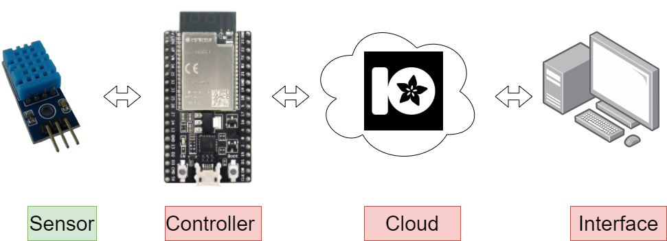
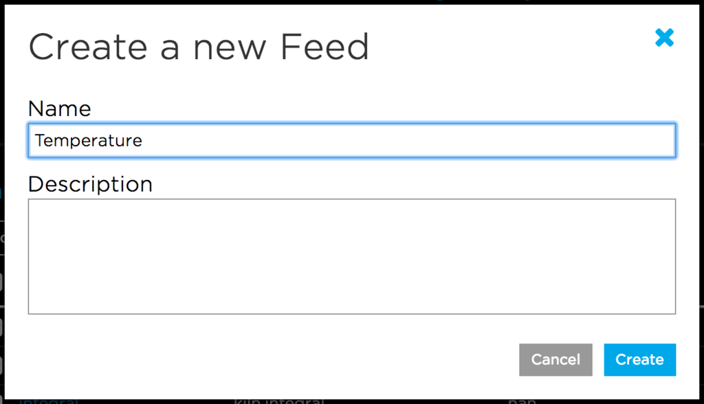
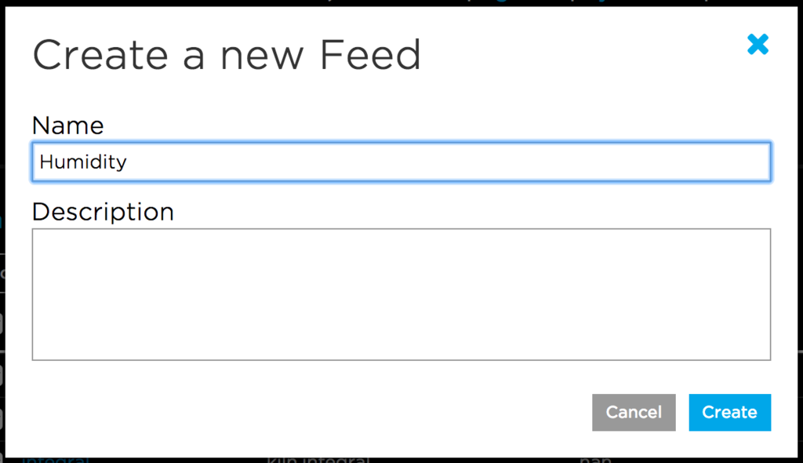
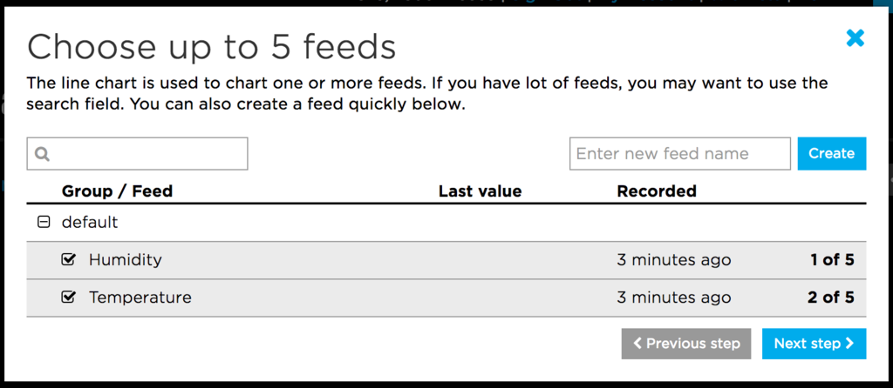
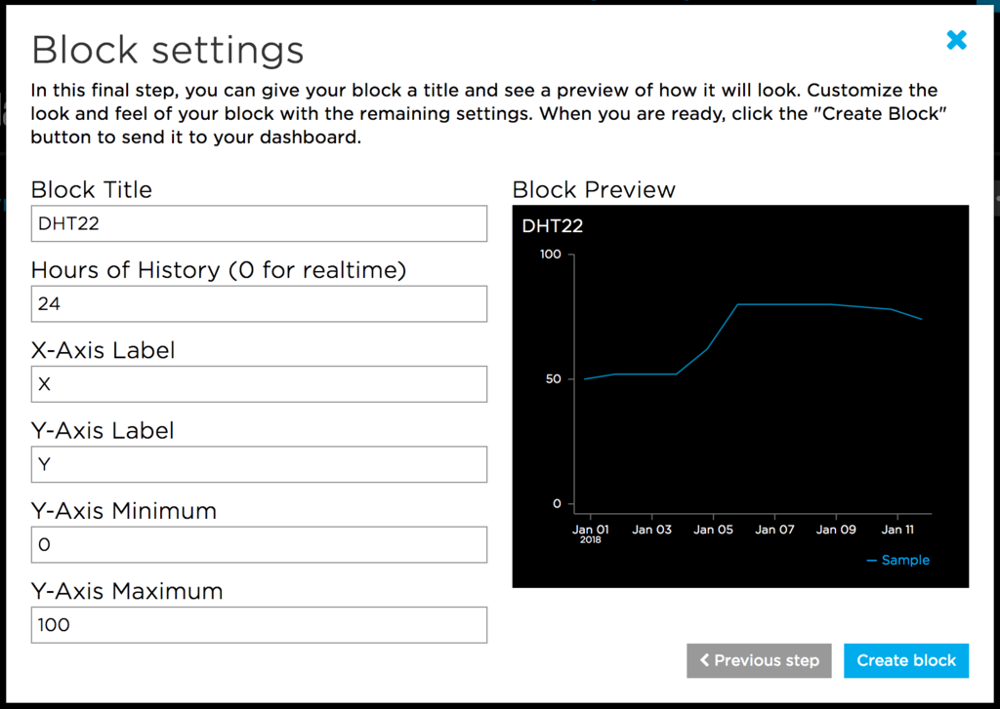
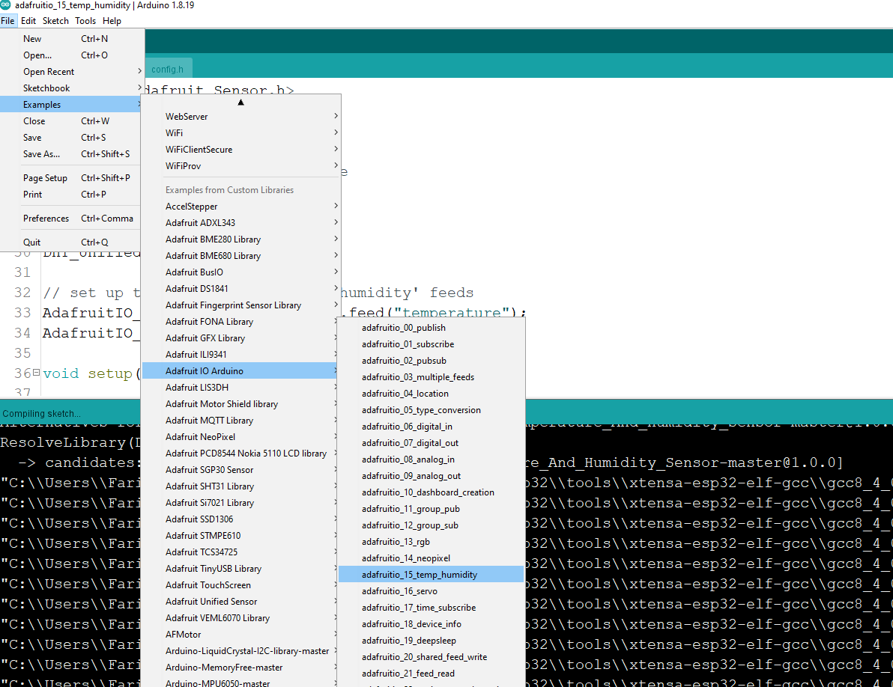

# Internet conneted thermostat ⌚ 

In this assignment, we will going to build digital internet connected thermostat to read temperature , humidity and light level. 

### Hardware Requirment 

* 1 x ESP32 Dev Kit 
* 1 x DHT Sensor 
* 1 x LDR 
* 1 X Email ID 
* 1 x Laptop with internet connection
* Few Jumper canles  

## Diagram

## Connection

| DH11   | ESP32|
| ----------- | ----------- |
|  +/VCC Pin    | 3.3v      |
| Out Pin  | D5  |
| -/GND | GND |

## Setup Adafruit IO

The first thing you will need to do is to login to Adafruit IO and visit the Settings page.

### Creating the Feeds

First, you will need to create a feed called Temperature. 

You will also need to create a feed called Humidity.

If you need help getting started with creating feeds on Adafruit IO, check out the Adafruit IO Feed Basics guide.

### Adding the Line Chart Block 

Add a new Line Chart block to a new or existing dashboard. Make sure you have selected both the Temperature and Humidity feeds as the data sources for the block.

When you reach the block settings, set the Hours of History setting to 24 hours, and name the block whatever you would like.

When you are finished editing the form, click Create Block to add the new block to the dashboard.

## Thank You.

For regarding any queries please use [makergram.com](https://community.makergram.com/)

## Code

