# Voice Controlled Light

In this workshop we will learn about how to control things using your voice, for this we are using Google Assistant as Interface and NodeMCU as Controller and Adafruit.io as Cloud, The NodeMCU is an opensource development board using esp8266.  and this is step by step guide complete the workshop. 

For regarding any queries please use [makergram.com](https://community.makergram.com/)

## Pre-requirements 

- Laptop
- Arduino IDE 
- ESP32
- LED
- USB micro to Mini Cable
- Internet Connectivity 
- Beginner level knowledge in programming 
- Android Phone
- Laptop/Desktop Computer
- Google Account


## Architecture

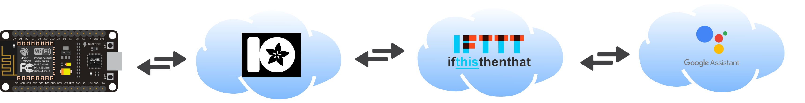

## Step 1 : Install Arduino IDE

We are using arduino IDE to upload code in ESP32. Goto https://www.arduino.cc/en/software and downalod Arduino IDE. 

## Step 2: Install ESP32 on Arduino IDE

Since ESP32 is third party dev kit, we need to install on esp32 to compile code. 

*  Add Board URL 

Open Arduino **Preferences Window**

 

* Enter one of the release links above into Additional Board Manager URLs field. You can add multiple URLs, separating them with commas.

```
https://raw.githubusercontent.com/espressif/arduino-esp32/gh-pages/package_esp32_index.json
```

 

* Open Boards Manager from Tools > Board menu and install esp32 platform (and do not forget to select your ESP32 board from Tools > Board menu after installation).


* Restart Arduino IDE.


## Step 3: Install Adafruit.io Libraries

You can install the library through the Arduino Library Manager (click: Sketch -> Include Library -> Manage Libraries...)


## 2. Setup Adafruit.io - Cloud 

We are using [Adafruit.io](https://io.adafruit.com) as the MQTT Broker and it's also have dashboard with lot of widgets  .So first you need to create an account if you did't have one [Adafruit.io](https://io.adafruit.com) or login with your credentials. 

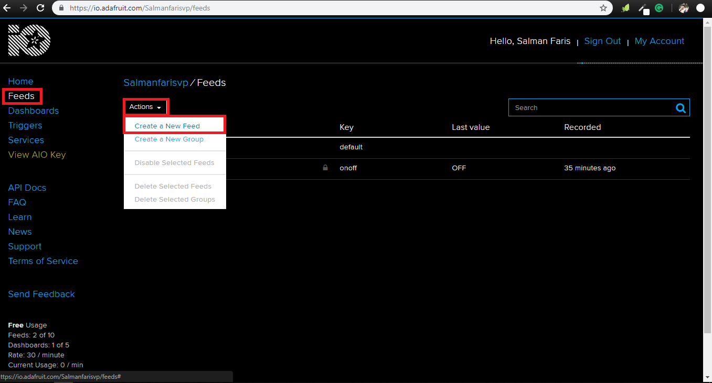

after login , create MQTT feed by clicking **Feeds** on the left menu bar and Click `create a New Feed` under the `Actions` bar .

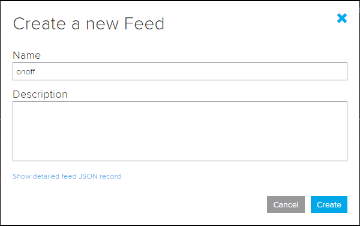

In the following window give a name for our new Feed , like **onoff** and click create. next we need to setup a dashboard for UI control , for that click **Dashboard** on the left menu bar and clikc `create a New Dashboard` under `bar`.

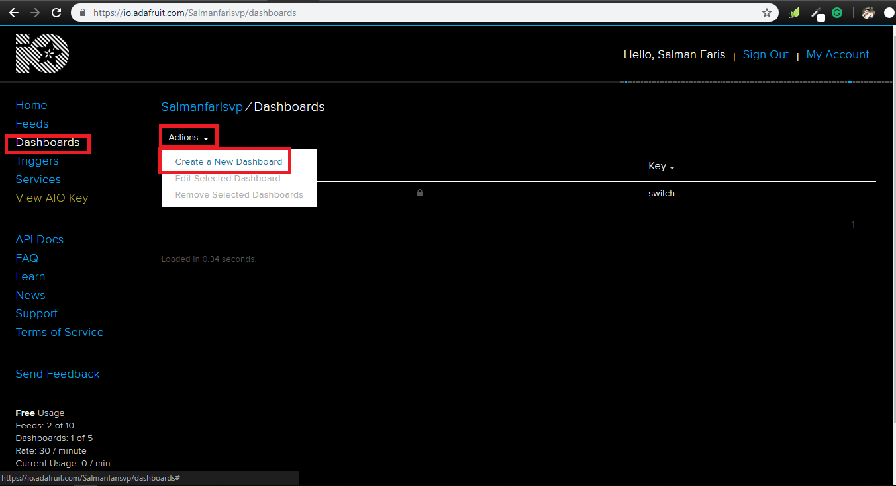

give a name to our new dashboard , I just put **Switch** . 

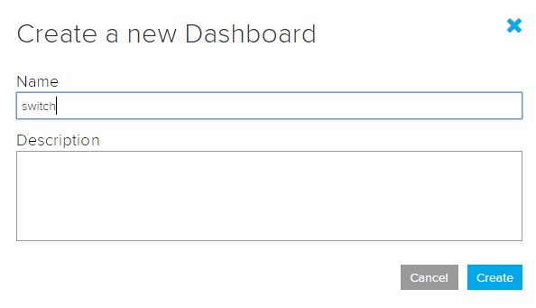

Now we can see the dashbord listed under the dashboard menu .

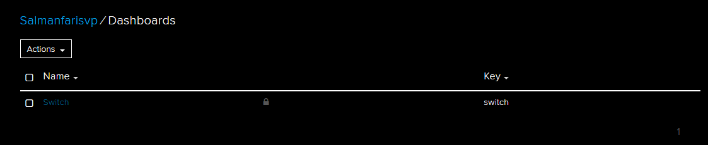

for editing the dashboard , select the dashboard by check the check box and click `create a new block` on top right menu .and the following window select the **Toggle** .

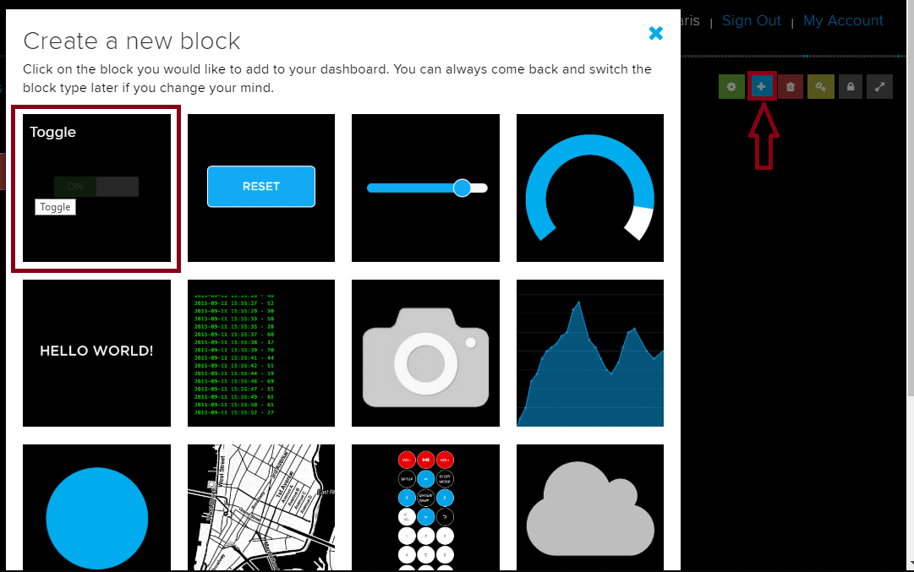

on the next step select the right Group/Feed and clikc `Next setp`.

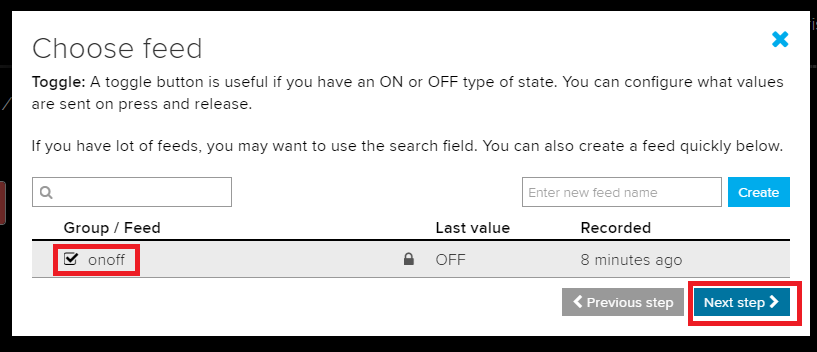

next we setup the `Block` , just leave as default and click `Create block`

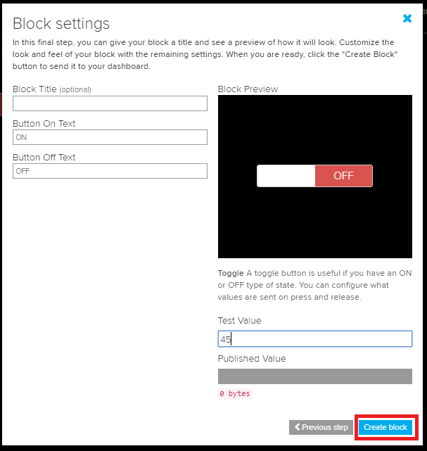

and We are done with the cloud part , our dashbord will look like this .

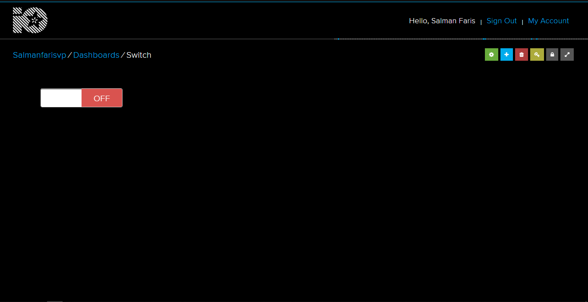


## 3.Programming 

Next upload the code , for that we need set target board in the Arduino IDE.

`Tools => Board => NodeMCU ESP-12E`

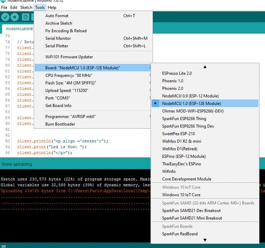

Select Port in same menu (in my case, I have Port-3).

`Note: Only the boards appear when you download the Board definitions.`


```

#include <ESP8266WiFi.h>
#include "Adafruit_MQTT.h"
#include "Adafruit_MQTT_Client.h"

#define WIFI_SSID "WiFi Name"
#define WIFI_PASS "WiFi Password"

#define MQTT_SERV "io.adafruit.com"
#define MQTT_PORT 1883
#define MQTT_NAME "Adafruit.io User Name"
#define MQTT_PASS "AIO key"

//Set up MQTT and WiFi clients
WiFiClient client;
Adafruit_MQTT_Client mqtt(&client, MQTT_SERV, MQTT_PORT, MQTT_NAME, MQTT_PASS);

//Set up the feed you're subscribing to
Adafruit_MQTT_Subscribe onoff = Adafruit_MQTT_Subscribe(&mqtt, MQTT_NAME "/f/onoff");


void setup()
{
  Serial.begin(9600);

  //Connect to WiFi
  Serial.print("\n\nConnecting Wifi... ");
  WiFi.begin(WIFI_SSID, WIFI_PASS);
  while (WiFi.status() != WL_CONNECTED)
  {
    delay(500);
  }

  Serial.println("OK!");

  //Subscribe to the onoff feed
  mqtt.subscribe(&onoff);

  pinMode(LED_BUILTIN, OUTPUT);
  digitalWrite(LED_BUILTIN, HIGH);
}

void loop()
{
  MQTT_connect();
  
  //Read from our subscription queue until we run out, or
  //wait up to 5 seconds for subscription to update
  Adafruit_MQTT_Subscribe * subscription;
  while ((subscription = mqtt.readSubscription(5000)))
  {
    //If we're in here, a subscription updated...
    if (subscription == &onoff)
    {
      //Print the new value to the serial monitor
      Serial.print("onoff: ");
      Serial.println((char*) onoff.lastread);
      
      //If the new value is  "ON", turn the light on.
      //Otherwise, turn it off.
      if (!strcmp((char*) onoff.lastread, "ON"))
      {
        //Active low logic
        digitalWrite(LED_BUILTIN, LOW);
      }
      else
      {
        digitalWrite(LED_BUILTIN, HIGH);
      }
    }
  }

  // ping the server to keep the mqtt connection alive
  if (!mqtt.ping())
  {
    mqtt.disconnect();
  }
}


/***************************************************
  Adafruit MQTT Library ESP8266 Example

  Must use ESP8266 Arduino from:
    https://github.com/esp8266/Arduino

  Works great with Adafruit's Huzzah ESP board & Feather
  ----> https://www.adafruit.com/product/2471
  ----> https://www.adafruit.com/products/2821

  Adafruit invests time and resources providing this open source code,
  please support Adafruit and open-source hardware by purchasing
  products from Adafruit!

  Written by Tony DiCola for Adafruit Industries.
  MIT license, all text above must be included in any redistribution
 ****************************************************/

void MQTT_connect() 
{
  int8_t ret;

  // Stop if already connected.
  if (mqtt.connected()) 
  {
    return;
  }

  Serial.print("Connecting to MQTT... ");

  uint8_t retries = 3;
  while ((ret = mqtt.connect()) != 0) // connect will return 0 for connected
  { 
       Serial.println(mqtt.connectErrorString(ret));
       Serial.println("Retrying MQTT connection in 5 seconds...");
       mqtt.disconnect();
       delay(5000);  // wait 5 seconds
       retries--;
       if (retries == 0) 
       {
         // basically die and wait for WDT to reset me
         while (1);
       }
  }
  Serial.println("MQTT Connected!");
}


```


Before uploding the code we need to change some parameters , like wifi congi,mqtt credentials ..

```
#define WIFI_SSID "WiFi Name"
#define WIFI_PASS "WiFi Password"

```

Replace the WiFi Name with your WiFi SSID name Password 


```
#define MQTT_NAME "Adafruit.io User Name"
#define MQTT_PASS "AIO key"

```
 In this code block re-place the MQTT_NAME with your Adafruit.io User name , and MQTT_PASS with AIO Key .

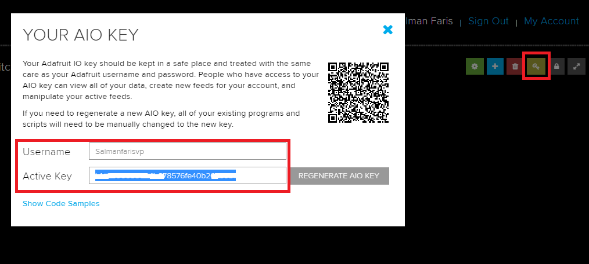


after uplaoding the code open your serial monitor (9600 buad rate) so we can see some usefull messages ,

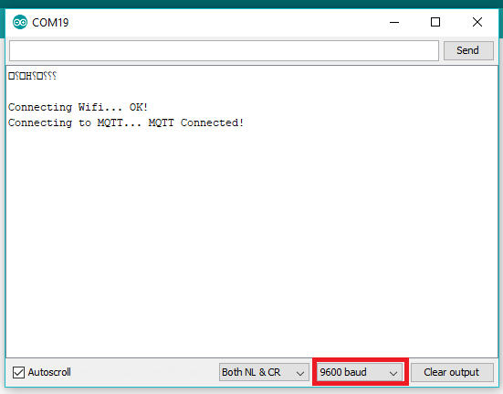


## 4. Testing Adafruit.io 

After the sketch uploading everything is fine we can now test the adafruit cloud dashboard .

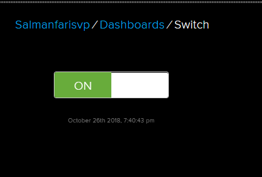

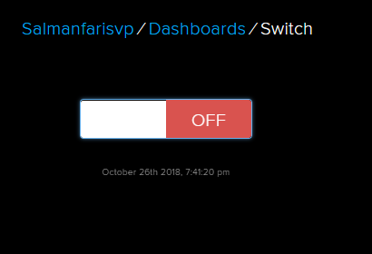

we can simply control the LED that connected to the NodeMCU by Toggle the Digital Switch . Yes , we just did some intenet connected Devices . we can now control the light anywhere in the world .


## 5. Google Assistant Integration

now we are just connected the our hardware module to the internet and we can now control it anywhere in the world ,  but it's little bit tricky to open the adafruit.io for only turn on the light , now days voice is the new interface so can do anything with our voice , we also have several voice assistant like Amazon Alexa , Google Assistant ...ect . so now we are going to control our device with a voice , more precisely ***Google Assistant*** in a simple way . let's do it.

### IFTTT 

 If This Then That, also known as IFTTT, is a free web-based service to create chains of simple conditional statements, called applets. An applet is triggered by changes that occur within other web services such as Gmail, Facebook, Telegram, Instagram, or Pinterest.

 so we are using the IFTTT to triger the Adafruit.io from the Google Assistant . 

 first we need to create an account [IFTTT](https://ifttt.com/).and click ***New Applet***


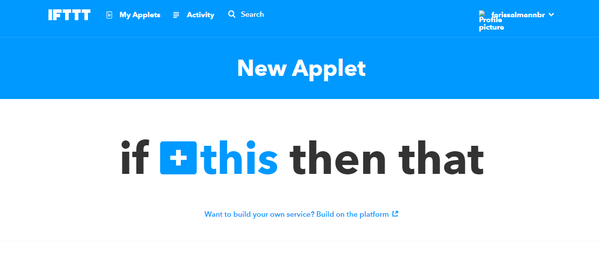

Click ***this*** button and select the google assistant from the service .

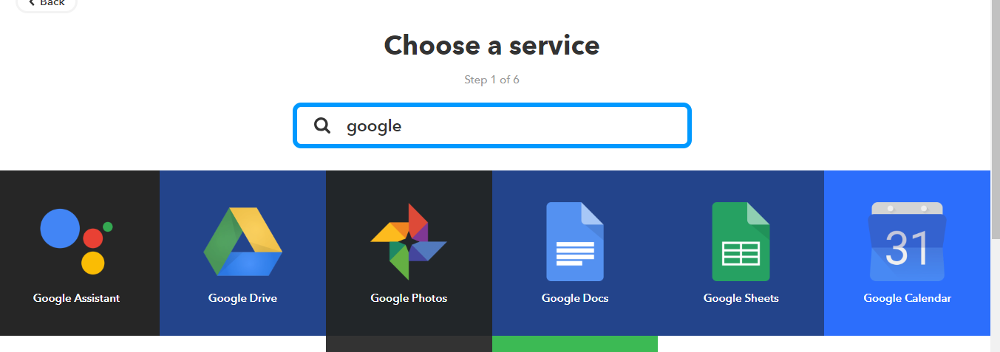

next choose a trigger from the listed items , for our application I used ***Say a simple phrase***


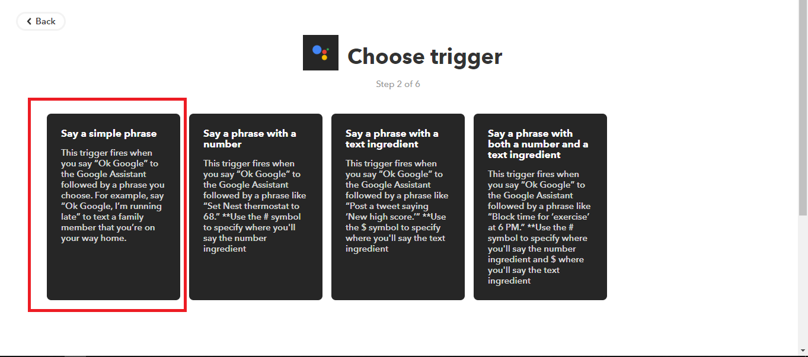

next we need to set Say a simple phrase , `This trigger fires when you say “Ok Google” to the Google Assistant followed by a phrase you choose. For example, say “Ok Google, I’m running late” to text a family member that you’re on your way home.`

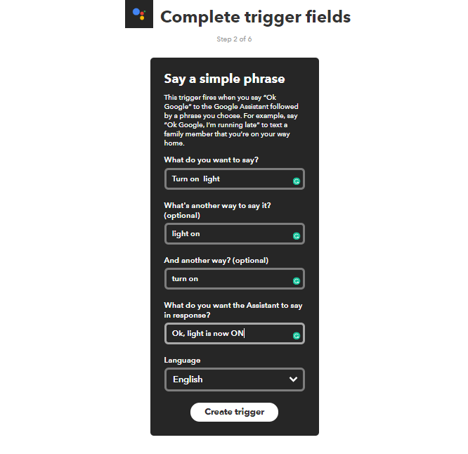

next select the ***that***


 we need select a ***Choose action service*** , we choosed Adafruit service

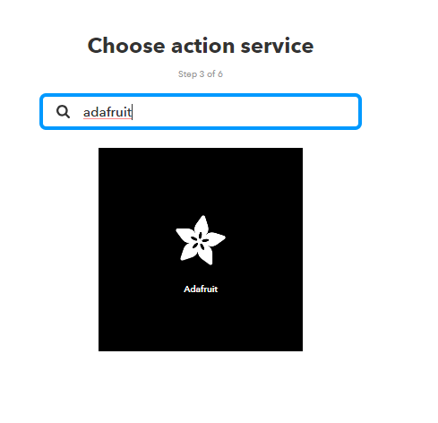


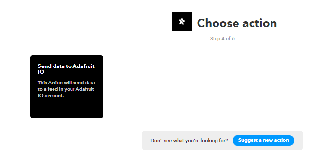

so next we need Complete action fields by gaving the Feed name and Data to save

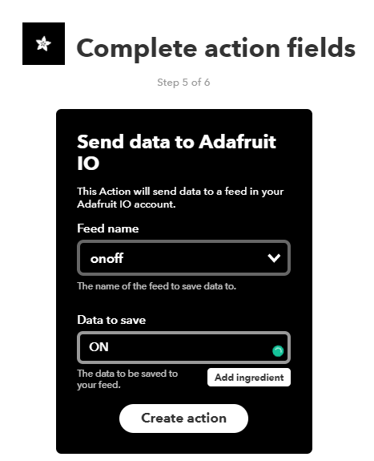

we completed the work and as last step we need to proceeds ***Review and finish***

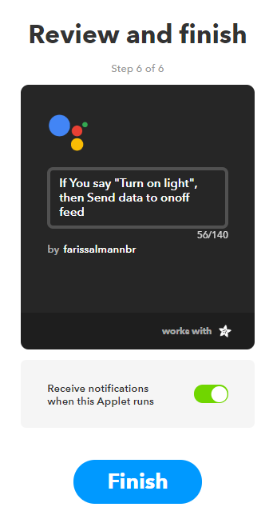

and we need to the same IFTTT Applet for Turn Off the Light .after that use your  Google Assistant in your mobile phone to control devices


## Thank You.

For regarding any queries please use [makergram.com](https://community.makergram.com/)


