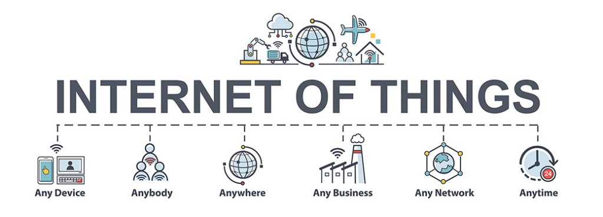

# Introduction to IoT 📡 + 💡 

Welcome to Internet of Things Basic Workshop, In here we will look into basic of arduino, ESP32 and IoT cloud platforms. 

### What is Internet of Things (IoT)?

The Internet of Things (IoT) describes the network of physical objects—“things”—that are embedded with sensors, software, and other technologies for the purpose of connecting and exchanging data with other devices and systems over the internet. These devices range from ordinary household objects to sophisticated industrial tools. [src](https://www.oracle.com/in/internet-of-things/what-is-iot/)

###  Why is Internet of Things (IoT) so important?

Over the past few years, IoT has become one of the most important technologies of the 21st century. Now that we can connect everyday objects—kitchen appliances, cars, thermostats, baby monitors—to the internet via embedded devices, seamless communication is possible between people, processes, and things.

By means of low-cost computing, the cloud, big data, analytics, and mobile technologies, physical things can share and collect data with minimal human intervention. In this hyperconnected world, digital systems can record, monitor, and adjust each interaction between connected things. The physical world meets the digital world—and they cooperate. [src](https://www.oracle.com/in/internet-of-things/what-is-iot/)

### IoT Use Cases

  1. Remote Asset Monitoring 
  2. Vehicle Fleet Management (track/trace)
  3. Predictive maintenance
  4. Energy Management
  5. Smart lighting
  6. Smart parking
  7. Structural Health Monitoring
  8. Waste Management. 
  9. Water conservation
  10. Smart Irrigation
  11. Leakage Management
  12. Water Quality Management 
  13. Patient Surveillance/Remote Patient Monitoring.

