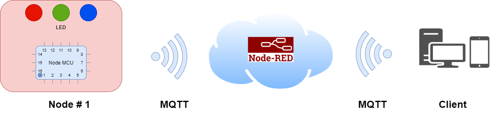
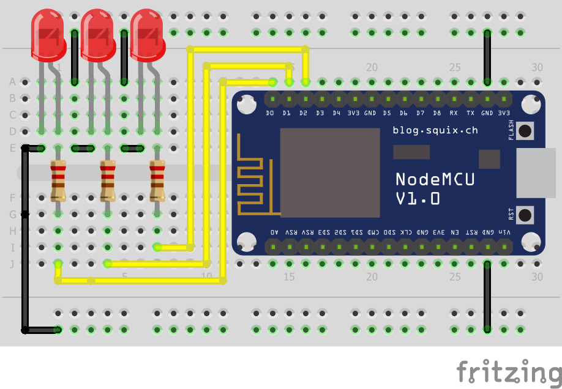
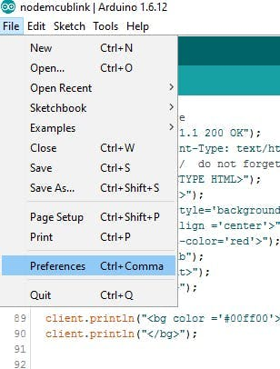

# Internet Conneted Lights  (NodeRED & MQTT) 💡

In this workshop we will going learn build a **Internet Conncted Lights** with the help of NodeRED and MQTT. 

#### Required Hardware 🛠

* NodeMCU ESP8266 
* LED's
* Switch 
* Raspberry Pi (Not mandatory)

#### Required Softwares 👨‍💻

* [Arduino IDE](https://www.arduino.cc/en/software)
* [NodeRED](https://nodered.org/)
* [Eclipse Mosquitto MQTT Broker ](https://mosquitto.org/)

## Architecture

## Step 1 : Connect NodeMCU and LED's

## Step 2: Install Arduino IDE and Add NodeMCU. 

You can download and Install Arduino IDE from here [Arduino IDE](https://www.arduino.cc/en/Main/Software) In default Arduino IDE only Support Native boards like UNO,Nano.. etc , so we need to install NodeMCU Board and MQTT Libraries .

#### NodeMCU Board Definition

Open Arduino IDE and add additional Board URL File => Preference (Ctrl + Comma)

In Additional Boards Manager, click add and paste the URL there http://arduino.esp8266.com/stable/package_esp8266com_index.json And click "OK".

