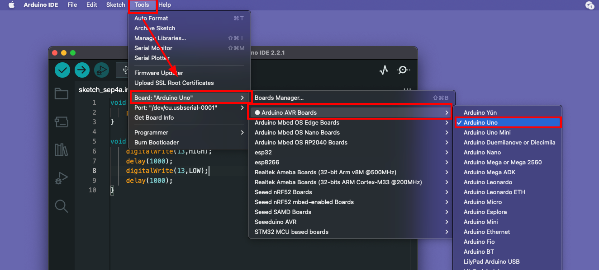
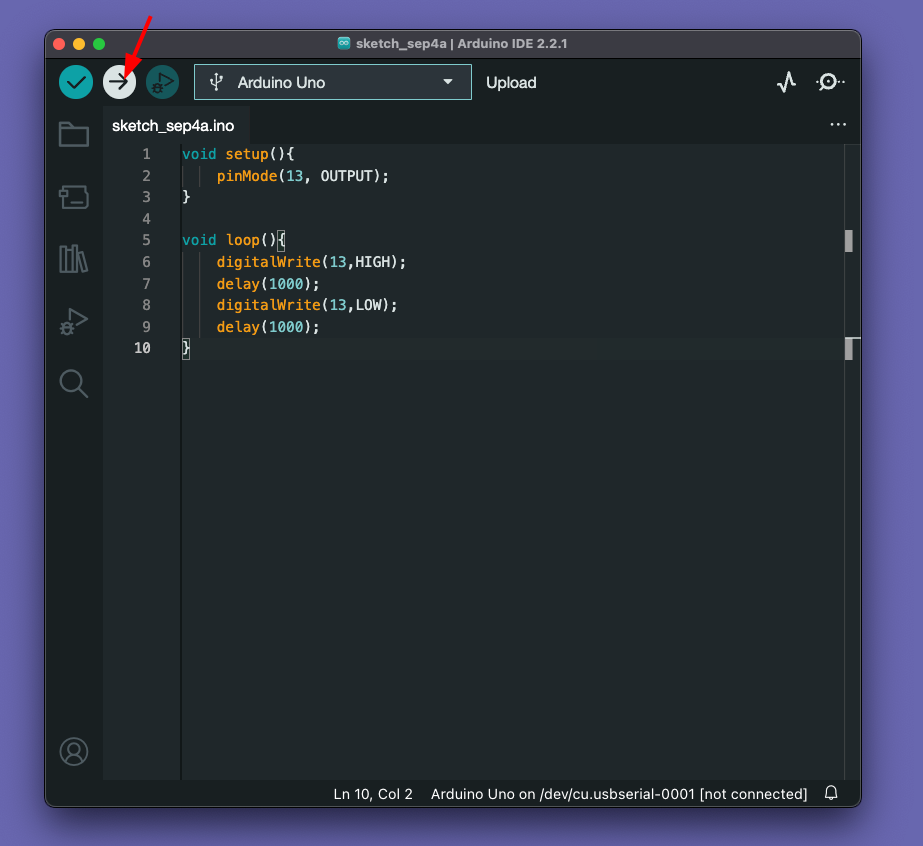
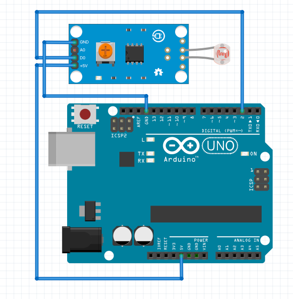

# Automatic Light ☀️💡

Here we are going to make a automatic light that can control itself based on ambient light, It can be used for streetlight so that streetlight can turn on when the night comes.


#### Required Hardware 🛠

* Arduino UNO x 1
* USB Type-B Cable x 1
* Light Dependent Resistors Module x 1   
* Jumper Wires 
* A Computer 

#### Required Software  🖥️

* Arduino IDE 

## Step 1: Introduction to Arduino ♾️

Ardunio is a company and they build tools that help us to build electonics projects and products in a easy way. In this project, we are going to use some of arduino tools such as **Arduino IDE** software, **Arduino UNO** development board. 

### 1.1 Arduino IDE 

 (📷src: Arduino.com)

* The Arduino **Integrated Development Environment** (IDE) is a crucial part of the Arduino ecosystem.
* It is a user-friendly software that allows users to **write, compile, and upload code to their Arduino boards**. 
* The IDE is compatible with various operating systems, making it accessible to a wide range of users. With its intuitive interface and simplified syntax, even beginners find it easy to program their Arduino boards and experiment with different projects.

#### ToDo ✅
- [ ] Download Arduino IDE : https://www.arduino.cc/en/software
- [ ] Install Arduino IDE on your computer. 
 
<hr></hr>

### 1.2 Arduino Development boards also know as Dev boards or Hardware Development Kits (HDK)

 
(📷src: circuitdigest.com)

* Arduino devboards serve as the foundation for numerous electronic projects. These boards come in different shapes and sizes, each catering to specific needs and capabilities. 
* Some popular Arduino boards include** Arduino Uno**, **Arduino Mega**, **Arduino Nano**, and A**rduino Due**, among others. 
* Each devboard features a microcontroller and various input/output pins, allowing users to interface with sensors, actuators, and other components seamlessly.

The beauty of Arduino devboards lies in their versatility.**They support a wide range of sensors and actuators**, such as temperature sensors, motion detectors, LCD screens, motors, and more. Whether you want to build a home automation system, a robot, a weather station, or an interactive art installation, there is an Arduino devboard suited for your project.

⭐️ Moreover, the vast Arduino community contributes to the richness of the platform. Users worldwide share their projects, tutorials, and libraries, allowing others to learn, collaborate, and build upon existing work. This spirit of open-source collaboration has played a pivotal role in making Arduino a powerful catalyst for innovation and creativity.

Here in this project, we are using the Arduino UNO model. 

(📷src: Arduino.com)

#### ToDo ✅
- [ ] Explore Arduino UNO 
- [ ] Understand Arduino UNO Components  
 
<hr></hr>


## Step 2: Hello World - Blink Project 

Whenever we are learning new project, we will first write and run "Hello World" project. In hardware, we will do a LED "Blink" as first project. 

### 2.1 Blink Sketch

In arduino, we call programs as sketch. For the first "Hello World", Copy the below code, and past to your arduino IDE. 

```cpp
void setup(){
    pinMode(13, OUTPUT);
}

void loop(){
    digitalWrite(13,HIGH);
    delay(1000);
    digitalWrite(13,LOW);
    delay(1000);
}
```    


### 2.2 Select the correct port and board 

After pasting the code from above, select the board as uno in **Tools -> Board -> Arduino AVR Boards -> Arduino Uno** and connect the uno with computer and select the correct port. 



#### 2.2 Upload the Sketch 

Upload the sketch by clicking the "Upload" button. It will compile and verify your skecth and upload the program. 



We can see the LED is blnking. (You don't need to attach a LED like the below image, you can see the onboard LED is blinking alone)


## Step 3: Automatic Light Build 🛠️

Now, you got an idea about how arduino works. Let's built the Smart Light, before that understand on how an LDR works. 


In and LDR, it's only passes current when it's hit's light on the surface in technic the resistance will reduce when light hit's. For the smartlight, we are trying to use the technique to control our main light. 

### Step 3.1 Connection Digram 
Connect the LDR and Arduino as mentioned below 

|LDR Pin| Arduino Pin|
|--------|------------|
|GND| Arduino GND|
|A0| |
|D0| Arduino D2|
|+5v/VCC| Arduino 5v|




#### Step 3.2 Upload code 

After the connecting, copy the code and upload. Try to read the comments in the code for better understanding. 

```cpp
const int buttonPin = 2;  // the number of the LDR pin
const int ledPin = 13;    // the number of the LED pin

// variables will change:
int buttonState = 0;  // variable for reading the LDR status

void setup() {
  // initialize the LED pin as an output:
  pinMode(ledPin, OUTPUT);
  // initialize the LDR pin as an input:
  pinMode(buttonPin, INPUT);
}

void loop() {
  // read the state of the pushbutton value:
  buttonState = digitalRead(buttonPin);

  // check if the LDR is have ligt. If it is, the LDR is HIGH:
  if (buttonState == HIGH) {
    // turn LED on:
    digitalWrite(ledPin, HIGH);
  } else {
    // turn LED off:
    digitalWrite(ledPin, LOW);
  }
}
```

After uploading, try to cover the LDR and see the onboard LED is turning ON. 


## Conclusion

Congratulations 👏👏 , you made "Automatic light" project with Arduino and LDR Sensor. 


