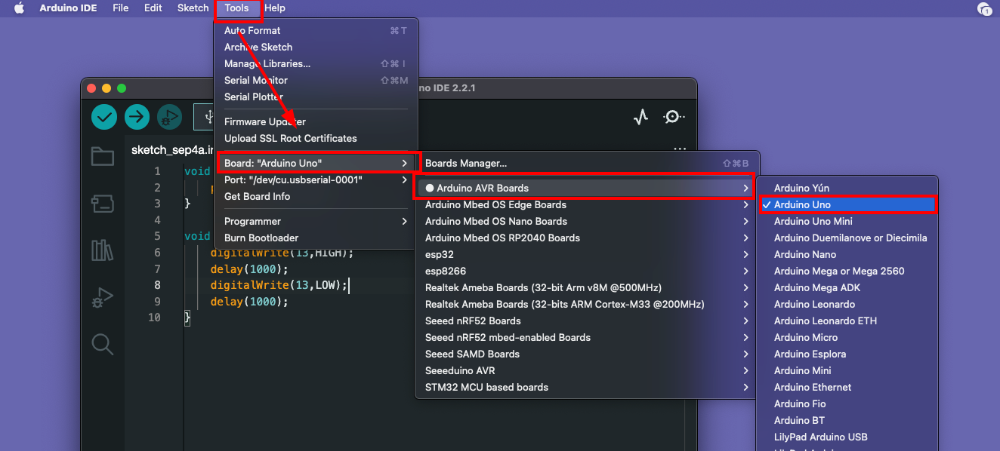
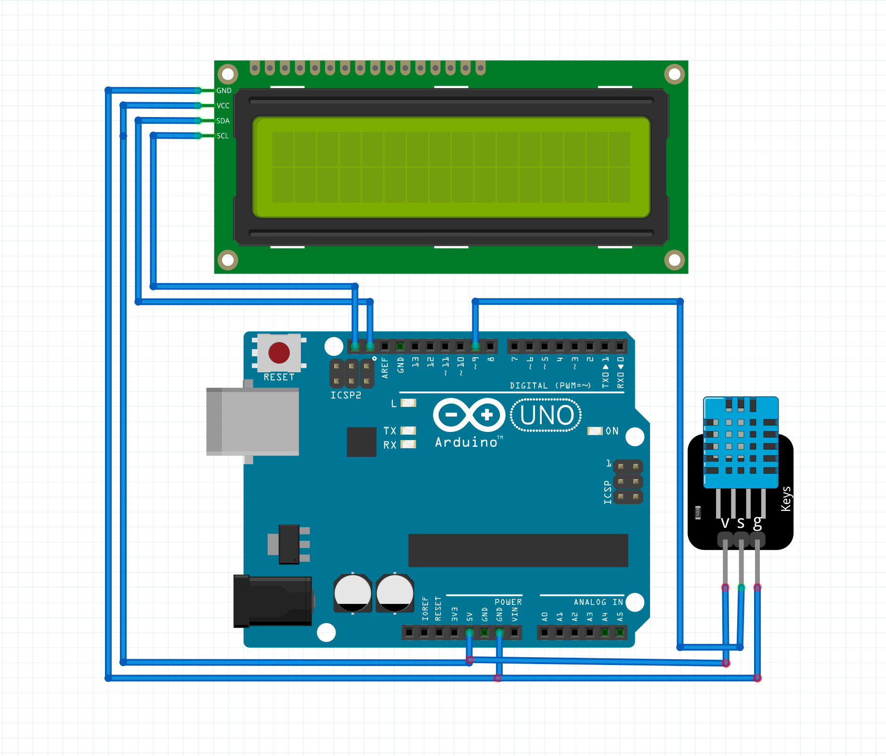

# Digital Thermometer 🌡️

Here we are going to make a Digital Thermometer that can meausre temperature and humidty using an sensor display it on LCD. .


#### Required Hardware 🛠

* Arduino UNO x 1
* USB Type-B Cable x 1
* DHT11 Sensor x 1  
* 16x2 LCD Module x 1 
* Jumper Wires 
* A Computer 

#### Required Software  🖥️

* Arduino IDE 

## Step 1: Introduction to Arduino ♾️

Ardunio is a company and they build tools that help us to build electonics projects and products in a easy way. In this project, we are going to use some of arduino tools such as **Arduino IDE** software, **Arduino UNO** development board. 

### 1.1 Arduino IDE 

 (📷src: Arduino.com)

* The Arduino **Integrated Development Environment** (IDE) is a crucial part of the Arduino ecosystem.
* It is a user-friendly software that allows users to **write, compile, and upload code to their Arduino boards**. 
* The IDE is compatible with various operating systems, making it accessible to a wide range of users. With its intuitive interface and simplified syntax, even beginners find it easy to program their Arduino boards and experiment with different projects.

#### ToDo ✅
- [ ] Download Arduino IDE : https://www.arduino.cc/en/software
- [ ] Install Arduino IDE on your computer. 
 
<hr></hr>

### 1.2 Arduino Development boards also know as Dev boards or Hardware Development Kits (HDK)

 
(📷src: circuitdigest.com)

* Arduino devboards serve as the foundation for numerous electronic projects. These boards come in different shapes and sizes, each catering to specific needs and capabilities. 
* Some popular Arduino boards include** Arduino Uno**, **Arduino Mega**, **Arduino Nano**, and A**rduino Due**, among others. 
* Each devboard features a microcontroller and various input/output pins, allowing users to interface with sensors, actuators, and other components seamlessly.

The beauty of Arduino devboards lies in their versatility.**They support a wide range of sensors and actuators**, such as temperature sensors, motion detectors, LCD screens, motors, and more. Whether you want to build a home automation system, a robot, a weather station, or an interactive art installation, there is an Arduino devboard suited for your project.

⭐️ Moreover, the vast Arduino community contributes to the richness of the platform. Users worldwide share their projects, tutorials, and libraries, allowing others to learn, collaborate, and build upon existing work. This spirit of open-source collaboration has played a pivotal role in making Arduino a powerful catalyst for innovation and creativity.

Here in this project, we are using the Arduino UNO model. 

(📷src: Arduino.com)

#### ToDo ✅
- [ ] Explore Arduino UNO 
- [ ] Understand Arduino UNO Components  
 
<hr></hr>


## Step 2: Hello World - Blink Project 

Whenever we are learning new project, we will first write and run "Hello World" project. In hardware, we will do a LED "Blink" as first project. 

### 2.1 Blink Sketch

In arduino, we call programs as sketch. For the first "Hello World", Copy the below code, and past to your arduino IDE. 

```cpp
void setup(){
    pinMode(13, OUTPUT);
}

void loop(){
    digitalWrite(13,HIGH);
    delay(1000);
    digitalWrite(13,LOW);
    delay(1000);
}
```    


### 2.2 Select the correct port and board 

After pasting the code from above, select the board as uno in **Tools -> Board -> Arduino AVR Boards -> Arduino Uno** and connect the uno with computer and select the correct port. 



#### 2.2 Upload the Sketch 

Upload the sketch by clicking the "Upload" button. It will compile and verify your skecth and upload the program. 


We can see the LED is blnking. (You don't need to attach a LED like the below image, you can see the onboard LED is blinking alone)


## Step 3: Digital Thermometer  Build 🛠️

Now, you got an idea about how arduino works. Let's built the digital scale one by one. First, we are going to test the sensor and then display the data on the LCD display. 

### 3.1: Test the Digital Humidty and Temperature (DHT11) Sensor

In this project, to measure the distance we are using an *DHT Sensor**. 


The DHT-11 Digital Temperature And Humidity Sensor is a basic, ultra low-cost digital temperature and humidity sensor. It uses a capacitive humidity sensor and a thermistor to measure the surrounding air and spits out a digital signal on the data pin (no analog input pins needed).

After that, we will display the Humidty and Temperature on a LCD display for protability. 

### 3.2 Connection Diagram 
Connect the DHT11 and Arduino as mentioned below 

|HCSR04 | Arduino Pin|
|--------|------------|
|GND| Arduino GND|
|SIGNAL| Arduino D9|
|+5v/VCC| Arduino 5v|


#### Upload Ultrasonic code 

We need to install an DHT Senseor library in the arduino IDE before compile and upload the code. Follow the below steps and install the lib.  Open Library Menue(1) , Enter the Library name ""DHT" (2) , and Install "DHT Sensor libray by Adafruit" library (3). 


After the connecting, copy the code and upload. Try to read the comments in the code for better understanding. 

```cpp
include "DHT.h"

#define DHTPIN 9     // Digital pin connected to the DHT sensor

#define DHTTYPE 11   // DHT 22  (AM2302), AM2321

DHT dht(DHTPIN, DHTTYPE);

void setup() {
  Serial.begin(9600);
  Serial.println(F("DHTxx test!"));

  dht.begin();
}

void loop() {
  // Wait a few seconds between measurements.
  delay(2000);

  // Reading temperature or humidity takes about 250 milliseconds!
  // Sensor readings may also be up to 2 seconds 'old' (its a very slow sensor)
  float h = dht.readHumidity();
  // Read temperature as Celsius (the default)
  float t = dht.readTemperature();


  Serial.print(F("Humidity: "));
  Serial.print(h);
  Serial.print(F("%  Temperature: "));
  Serial.print(t);
  Serial.println(F("°C "));

}
```
After uploading, open the Serial monitor by cliking the right corner lense icon (1) on arduino IDE and see the Humidity and Temperature printed on below (2). 


Congratulations 👏👏 , you are successfully intergrated the DHT sensor with the Arduino UNO and able to read tha data and display it on Arduino IDE Serial monitor. 

### 3.3 Test the LCD display. 

We can't carry the computer always with our proect to see the distace right? so we need to display the distance on a display to make it more portable. For that, we are using 16x2 LCD display with I2C Interface. Before using it on a project we need to test the LCD individually and see it's working. 


### 3.4 Connection Diagram 
Connect the LCD and Arduino as mentioned below 

|LCD | Arduino Pin|
|--------|------------|
|GND| Arduino GND|
|VCC| Arduino 5v|
|SDA| Arduino SDA|
|SCL| Arduino SCL|


#### Upload LCD demo code 

### 3.5 Install "LiquidCrystal_I2C" Arduino Library. 

We need to install an library in the arduino IDE before compile and upload the code. Follow the below steps and install the lib.  Open Library Menue(1) , Enter the Library name ""LiquidCrystal_I2C" (2) , and Install "Frank de Brabander" library (3). 


### 3.6 Upload Code. 

```cpp
#include <Wire.h>
#include <LiquidCrystal_I2C.h>

LiquidCrystal_I2C lcd(0x27, 20, 4);  // set the LCD address to 0x27 for a 16 chars and 2 line display

void setup() {
  lcd.init();  // initialize the lcd
  lcd.init();
  lcd.backlight();

  lcd.clear();  // clear the LCD

  lcd.setCursor(2, 0);  //Set cursor to character 2 on line 0
  lcd.print("Hello world!");

  lcd.setCursor(2, 1);  //Move cursor to character 2 on line 1
  lcd.print("LCD Tutorial");
}

void loop() {
}

```

After uploading, you can see the text printed on LCD, yeey 🥳.  


##

## Intergrate Ultrasonic Sensor + LCD Display for final project.

Finally, we need to intergrate the both module and make the final project. 

### 3.7 Connection Diagram. 

Connect everything as per the below diagram. 


|Module| Arduino Pin|
|--------|------------|
|DHT11 GND| Arduino GND|
|DHT11 SIGNAL| Arduino D9|
|DHT11 +5v/VCC| Arduino 5v|
|LCD GND| Arduino GND|
|LCD VCC| Arduino 5v|
|LCD SDA| Arduino SDA|
|LCD SCL| Arduino SCL|




### 3.8 Full Code. 

```cpp
#include "DHT.h"
#include <Wire.h>
#include <LiquidCrystal_I2C.h>

#define DHTPIN 9  // Digital pin connected to the DHT sensor

#define DHTTYPE DHT11  // DHT 22  (AM2302), AM2321

DHT dht(DHTPIN, DHTTYPE);

LiquidCrystal_I2C lcd(0x3F, 20, 4);  // set the LCD address to 0x27 for a 16 chars and 2 line display

void setup() {
  Serial.begin(9600);
  Serial.println(F("DHTxx test!"));

  dht.begin();

  lcd.init();  // initialize the lcd
  lcd.init();
  lcd.backlight();
}

void loop() {
  // Wait a few seconds between measurements.
  delay(2000);

  // Reading temperature or humidity takes about 250 milliseconds!
  // Sensor readings may also be up to 2 seconds 'old' (its a very slow sensor)
  float h = dht.readHumidity();
  // Read temperature as Celsius (the default)
  float t = dht.readTemperature();


  Serial.print(F("Humidity: "));
  Serial.print(h);
  Serial.print(F("%  Temperature: "));
  Serial.print(t);
  Serial.println(F("°C "));


  lcd.clear();

  lcd.setCursor(0, 0);  // Sets the location at which subsequent text written to the LCD will be displayed
  lcd.print("Temp ");   // Prints string "Distance" on the LCD
  lcd.print("   Humidity");
  lcd.setCursor(0, 1);
  lcd.print(t);  // Prints the distance value from the sensor
  lcd.print("`c   ");
  lcd.print(h);
  lcd.print("%");


  delay(300);
}

```


## Conclusion

Congratulations 👏👏 , you made "Digital thermometer" project with Arduino , DHT Sensor and LCD Disply module. 


