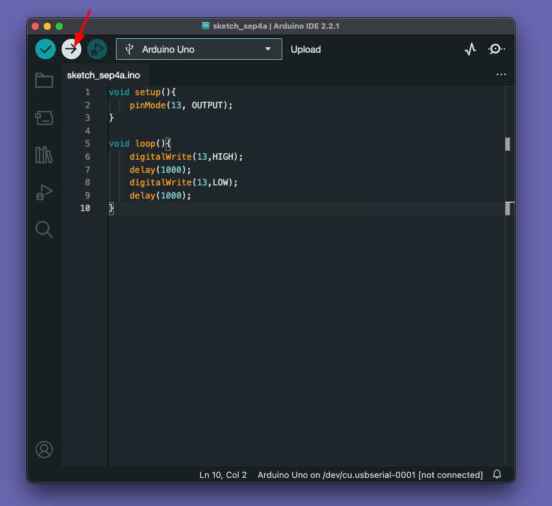

# Smart Light 📱💡

Here we are going to make a Smart light that can be control via Phone.


#### Required Hardware 🛠

* Arduino UNO x 1
* USB Type-B Cable x 1
* LED x 1  
* HC-05 BT module x 1 
* Jumper Wires 
* A Computer 

#### Required Software  🖥️

* Arduino IDE 

## Step 1: Introduction to Arduino ♾️

Ardunio is a company and they build tools that help us to build electonics projects and products in a easy way. In this project, we are going to use some of arduino tools such as **Arduino IDE** software, **Arduino UNO** development board. 

### 1.1 Arduino IDE 

 (📷src: Arduino.com)

* The Arduino **Integrated Development Environment** (IDE) is a crucial part of the Arduino ecosystem.
* It is a user-friendly software that allows users to **write, compile, and upload code to their Arduino boards**. 
* The IDE is compatible with various operating systems, making it accessible to a wide range of users. With its intuitive interface and simplified syntax, even beginners find it easy to program their Arduino boards and experiment with different projects.

#### ToDo ✅
- [ ] Download Arduino IDE : https://www.arduino.cc/en/software
- [ ] Install Arduino IDE on your computer. 
 
<hr></hr>

### 1.2 Arduino Development boards also know as Dev boards or Hardware Development Kits (HDK)

 
(📷src: circuitdigest.com)

* Arduino devboards serve as the foundation for numerous electronic projects. These boards come in different shapes and sizes, each catering to specific needs and capabilities. 
* Some popular Arduino boards include** Arduino Uno**, **Arduino Mega**, **Arduino Nano**, and A**rduino Due**, among others. 
* Each devboard features a microcontroller and various input/output pins, allowing users to interface with sensors, actuators, and other components seamlessly.

The beauty of Arduino devboards lies in their versatility.**They support a wide range of sensors and actuators**, such as temperature sensors, motion detectors, LCD screens, motors, and more. Whether you want to build a home automation system, a robot, a weather station, or an interactive art installation, there is an Arduino devboard suited for your project.

⭐️ Moreover, the vast Arduino community contributes to the richness of the platform. Users worldwide share their projects, tutorials, and libraries, allowing others to learn, collaborate, and build upon existing work. This spirit of open-source collaboration has played a pivotal role in making Arduino a powerful catalyst for innovation and creativity.

Here in this project, we are using the Arduino UNO model. 

(📷src: Arduino.com)

#### ToDo ✅
- [ ] Explore Arduino UNO 
- [ ] Understand Arduino UNO Components  
 
<hr></hr>


## Step 2: Hello World - Blink Project 

Whenever we are learning new project, we will first write and run "Hello World" project. In hardware, we will do a LED "Blink" as first project. 

### 2.1 Blink Sketch

In arduino, we call programs as sketch. For the first "Hello World", Copy the below code, and past to your arduino IDE. 

```cpp
void setup(){
    pinMode(13, OUTPUT);
}

void loop(){
    digitalWrite(13,HIGH);
    delay(1000);
    digitalWrite(13,LOW);
    delay(1000);
}
```    


### 2.2 Select the correct port and board 

After pasting the code from above, select the board as uno in **Tools -> Board -> Arduino AVR Boards -> Arduino Uno** and connect the uno with computer and select the correct port. 


#### 2.2 Upload the Sketch 

Upload the sketch by clicking the "Upload" button. It will compile and verify your skecth and upload the program. 



We can see the LED is blnking. (You don't need to attach a LED like the below image, you can see the onboard LED is blinking alone)


## Step 3: Smart Light Build 🛠️

Now, you got an idea about how arduino works. Let's built the smart light. 

### 3.1 Connection Diagram 
Connect the HC05 Bluetooth mpdule and Arduino as mentioned below 

|HC05 BT Module | Arduino Pin|
|--------|------------|
|GND| Arduino GND|
| RX | Arduino D2|
| TX | Arduino D3|
|VCC| Arduino 3.3v|


#### 3.2 Upload Ultrasonic code 

After the connecting, copy the code and upload. Try to read the comments in the code for better understanding. 

```cpp
#include <SoftwareSerial.h>

SoftwareSerial HM10(2, 3);  // RX = 2, TX = 3

char appData;

String inData = "";

void setup()

{

  Serial.begin(9600);

  Serial.println("HM10 serial started at 9600");

  HM10.begin(9600);  // set HM10 serial at 9600 baud rate

  pinMode(13, OUTPUT);  // onboard LED

  digitalWrite(13, LOW);  // switch OFF LED
}


void loop()

{

  HM10.listen();  // listen the HM10 port

  while (HM10.available() > 0) {  // if HM10 sends something then read

    appData = HM10.read();

    inData = String(appData);  // save the data in string format

    Serial.write(appData);
  }

  if (Serial.available()) {  // Read user input if available.

    delay(10);

    HM10.write(Serial.read());
  }

  if (inData == "F") {

    Serial.println("LED OFF");

    digitalWrite(13, LOW);  // switch OFF LED

    delay(500);
  }

  if (inData == "N") {

    Serial.println("LED ON");

    digitalWrite(13, HIGH);  // switch OFF LED
  }
}

```


### 3.3 Demo

Install "Serial Bluetooth App" from [Playstore](https://play.google.com/store/apps/details?id=de.kai_morich.serial_usb_terminal&hl=en_IN&gl=US). 


### 3.4 Setup the Mobile application 
Connect the LCD and Arduino as mentioned below 

0. open "Serial Bluetooth" and provide the BT and location app from the Device system. 
1. Select "Devices" option to see the connected BT devices. 
2. Select "HC-05" 
3. Click Connect button on the top right corner and you can see connected on the below terminal text. 
4. Click "M1" button to rename the function
5. Rename the function as "ON" for ON and "OFF" for OFF 
6. Put the value "N" for ON and "F" for OFF (need to done for M1 and M2 function listed on step 4)
7. Click Save option. 


Then enter the M1 button to Turn ON the LED and M2 to turn OFF the LED. 


## Conclusion

Congratulations 👏👏 , you made "Smart Light" project with Arduino. Kudos. 