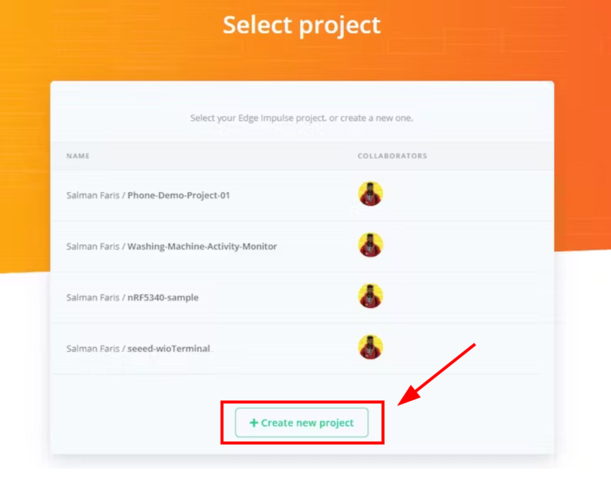
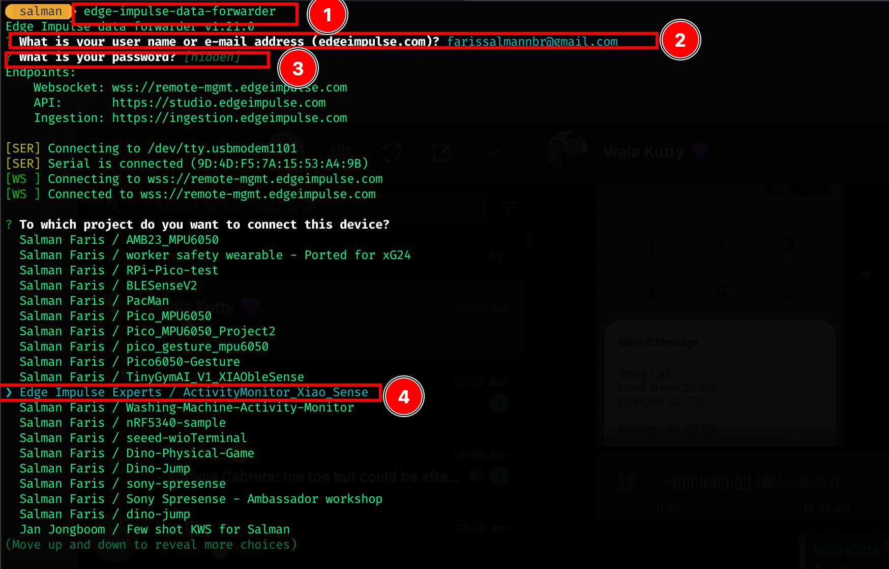
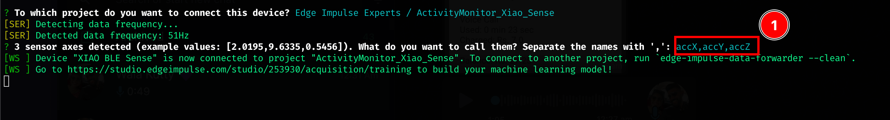

# Activity Sense ✨ - Human Activity Monitor 

In today's sedentary lifestyle, individuals often struggle to maintain a balanced level of physical activity throughout their daily routines. Prolonged periods of sitting, lack of movement, and inadequate standing time can lead to various health issues, including obesity, cardiovascular problems, and musculoskeletal disorders. To address this concern and promote a healthier lifestyle, there is a pressing need for an efficient and accurate human activity monitoring system.

ActivitySense, a fascinating DIY human activity monitoring project that empowers you to build your own activity tracker using readily available components. By combining the SeeedStudio XIAO nRF52840 Sense controller, Edge Impulse machine learning platform, and Blueswirless Wifi module, you can create a personalized human activity monitor that helps you stay on top of your daily movement.

1. **SeeedStudio XIAO nRF52840 Sense Controller**: The heart of this DIY project is the SeeedStudio XIAO nRF52840 Sense controller. This compact microcontroller comes equipped with powerful features such as Bluetooth 5.0 and multi-sensor data fusion. With the XIAO nRF52840 Sense at the core, you can collect real-time data from accelerometers and gyroscopes, making activity tracking accurate and reliable.

2. **Edge Impulse Machine Learning Platform**: Take your DIY activity monitor to the next level by integrating it with the Edge Impulse machine learning platform. This fantastic tool allows you to train your device with datasets containing various activity Porpatterns. By doing so, your ActivitySense becomes adept at recognizing activities like sitting, walking, and standing, providing you with personalized insights based on your specific routines.

3. **Blueswirless Wifi Module**: To enable seamless data transfer and connectivity in your DIY project, the Blueswirless Wifi module comes to the rescue. With this module, your ActivitySense can effortlessly transmit monitored activity data to the cloud. By connecting it to your smartphone or other devices, you gain access to comprehensive activity reports and stay on top of your fitness goals.

### Key Features of  ActivitySense:

* Real-time monitoring of sitting time, walking time, and standing time, offering immediate feedback on your daily activity levels.
* Accurate activity recognition through the powerful combination of SeeedStudio XIAO nRF52840 Sense and Edge Impulse's machine learning algorithms.
* Cloud connectivity using the Blueswirless Wifi module for easy access to activity data on-the-go.
* User-friendly interface for DIY enthusiasts of all skill levels to build and configure their personalized activity tracker.

## How it's works. 

[Need to add a draw.io image here]

# Let's build one 🛠️

Follow the below guide to build the **Ativity Sense ✨ - Human Activity Monitor** Project. 

### Hardware Requirements 🔩
* Seeed XIAO nRF52840 Sense
* Type-C Cable 
* Laptop/Desktop computer
* Blues Starter Kit with WiFi Card

### Software Installations 💻
Attendees only need some very basic knowledge of Arduino development and understanding of 101-level C coding concepts. Some (free) software installations are required:

* Arduino IDE 
* Install the Edge Impulse CLI
* Create a free Blues Notehub account
* Create a free Edge Impulse Studio account
* Create a free Datacake account
* XIAO Hand Strap 


### Workshop Agenda  📖 

All of the resources needed to present the workshop are available in the venue. Please let us know if anything missing. 

* Welcome and Introductions **[5 mins]**
* Introduce the Seeed XIAO nRF52840 Hardware **[5 mins]**
* Introduce the Edge Impulse platform**[5 mins]**
* Introduce the Blues Hardware **[5 mins]**
* Hands-on: XIAO blink **[15 mins]**
* Hands-on: XIAO IMU Data Forwarding to Edge Impulse **[15 mins]**
* hands-on: Create Impulse and Deploy **[20 mins]**
* hands-on: Build and run inference program on XIAO **[10 mins]**
* Hands-on: Notecard + Notecarrier Standalone Quickstart **[20 mins]**
* Hands-on: Visualizing Generated Inferences in Datacake **[20 mins]**

## Step 1: Introductions 🔖 

1. [Introduction to TinyML 💪 + 🧠](../../docs/tiny-ml-workshop/intro) 
2. [Introduction to Arduino ♾️](../../docs/tiny-ml-workshop/introductionToArduino) => Install Arduino IDE 
3. [Introduction to XIAO nRF52840 Sense 🍀](../../docs/tiny-ml-workshop/IntroductionToXiao) => Install XIAO on Arduino , run blink project. 
4. [Introduction to EdgeImpulse 💪](../../docs/tiny-ml-workshop/IntroductionToEdgeImpulse) => Create Edge Impulse account. 
5. [Introduction to Blueswirless 📡](../../docs/tiny-ml-workshop/IntroductionToBlues) => Create Blues wirless account. 

## Step 2: Fetch Accelerometer data from XIAO 🧺

Next, we need to read the Accelerometer data from the XIAO inbuilt Accelerometer senseor. For that please follow the below guide. 

#### Step 2.1: Connect the Seeed Studio XIAO nRF52840 Sense to your computer via a USB Type-C cable.


#### Step 2.2: Upload ReadXIAOAccelerometer.ino sketch

```
// XIAO BLE Sense LSM6DS3 Data  Forwarder 

#include "LSM6DS3.h"
#include "Wire.h"

//Create a instance of class LSM6DS3
LSM6DS3 myIMU(I2C_MODE, 0x6A);  //I2C device address 0x6A

#define CONVERT_G_TO_MS2 9.80665f
#define FREQUENCY_HZ 50
#define INTERVAL_MS (1000 / (FREQUENCY_HZ + 1))

static unsigned long last_interval_ms = 0;


void setup() {
  Serial.begin(115200);
  while (!Serial)
    ;

  if (myIMU.begin() != 0) {
    Serial.println("Device error");
  } else {
    Serial.println("Device OK!");
  }
}


void loop() {
  if (millis() > last_interval_ms + INTERVAL_MS) {
    last_interval_ms = millis();
    Serial.print(myIMU.readFloatAccelX() * CONVERT_G_TO_MS2, 4);
    Serial.print('\t');
    Serial.print(myIMU.readFloatAccelY() * CONVERT_G_TO_MS2, 4);
    Serial.print('\t');
    Serial.println(myIMU.readFloatAccelZ() * CONVERT_G_TO_MS2, 4);
  }
}

```

Upload the abobe code to your XIAO Sense and open the serial monitor or serial ploter to see the accelerometer data.

#### Step 2.3: Install the XIAO to the hand using the Strap provided. 


Install the band on your hand as mentioned on the above image and then move you hand after opeing the Serial montior or Serial plotter. 


You can also see the data over the Serial Plotter. 


## Step 3:  Connect to Edge impulse and Forward Accelerometer data  🎛️. 

As of now, we can see the accelerometer data from from the XIAO using arduino IDE serial monitor, now we need to forward the data to the edge impulse for post processing. 

### Step 3.1: Create an Edge Impulse project. 

First, we need to create an edge impulse account. for that go to https://studio.edgeimpulse.com/login select **Sign Up**, or if you already have an account enter **Username/Email** and **password**.


### Step 3.2: Create Edge Impulse Project

After creating an account, we need to create an edgeImpulse project. For that click your profile and select Create a new project or use this [URL](https://studio.edgeimpulse.com/studio/select-project#create-new-project). 



Then provide a project name, then click **Create new project** . 


Next, you can see the studio page, which means you successfully created an edge Impulse project 🎉


## Step 4: Connect the XIAO with EdgeImpulse and start collect data 🪣. 

Next, we need to connect the XIAO with the edgeimpulse to collect the data, and for that you need follow the below steps. 

### Steps 4.1 Install Edge impulse CLI in your computer. 

This Edge Impulse CLI is used to control local devices, act as a proxy to synchronise data for devices that don't have an internet connection, and to upload and convert local files. The CLI consists of seven tools:

* [edge-impulse-daemon](https://docs.edgeimpulse.com/docs/edge-impulse-cli/cli-daemon) - configures devices over serial, and acts as a proxy for devices that do not have an IP connection.
* [edge-impulse-uploader](https://docs.edgeimpulse.com/docs/edge-impulse-cli/cli-uploader) - allows uploading and signing local files.
* [edge-impulse-data-forwarder](https://docs.edgeimpulse.com/docs/edge-impulse-cli/cli-data-forwarder) - a very easy way to collect data from any device over a serial connection, and forward the data to Edge Impulse.
* [edge-impulse-run-impulse](https://docs.edgeimpulse.com/docs/edge-impulse-cli/cli-run-impulse) - show the impulse running on your device.
* [edge-impulse-blocks](https://docs.edgeimpulse.com/docs/edge-impulse-cli/cli-blocks) - create organizational transformation, custom dsp, custom deployment and custom transfer learning blocks.
* [himax-flash-tool](https://docs.edgeimpulse.com/docs/edge-impulse-cli/himax-flash-tool) - to flash the Himax WE-I Plus


#### Installation - Windows
1. Create an [Edge Impulse account](https://studio.edgeimpulse.com/signup).
2. Install [Python 3](https://www.python.org/) on your host computer.
3. Install [Node.js](https://nodejs.org/en/) v14 or higher on your host computer.
    * For Windows users, install the Additional Node.js tools (called Tools for Native Modules on newer versions) when prompted.
4. Install the CLI tools via:
    ``npm install -g edge-impulse-cli --force``

You should now have the tools available in your PATH.

#### Installation - Linux, Ubuntu, MacOS, and Raspbian OS

1. Create an [Edge Impulse account](https://studio.edgeimpulse.com/signup).
2. Install [Python 3](https://www.python.org/) on your host computer.
3. Install [Node.js](https://nodejs.org/en/) v14 or higher on your host computer.
Alternatively, run the following commands:
```
curl -sL https://deb.nodesource.com/setup_14.x | sudo -E bash -
sudo apt-get install -y nodejs
node -v
```
The last command should return the node version, v14 or above.
Let's verify the node installation directory:
``npm config get prefix``
If it returns /usr/local/, run the following commands to change npm's default directory:
```
mkdir ~/.npm-global
npm config set prefix '~/.npm-global'
echo 'export PATH=~/.npm-global/bin:$PATH' >> ~/.profile
```
On MacOS you might be using zsh as default, so you will want to update the correct profile
```
mkdir ~/.npm-global
npm config set prefix '~/.npm-global'
echo 'export PATH=~/.npm-global/bin:$PATH' >> ~/.zprofile
```
4. Install the CLI tools via:
``npm install -g edge-impulse-cli``
You should now have the tools available in your PATH.

For more details, check here https://docs.edgeimpulse.com/docs/edge-impulse-cli/cli-installation. 

### Steps 4.2 Connect the XIAO to the Edgeimpulse project we created 

We need to connect the XIAO board to a specific project. For that, follow th steps after installig the edge impulse CLI 

Enter the command ``edge-impulse-data-forwarder`` CLI to start the data forwarder and provide the information. It's similar to below image


 1. Run command ``edge-impulse-data-forwarder`` 
 2. Enter edge impulse account email account 
 3. Enter edge impulse account password
 4. Select project from the list. 

After selecting the project, we need to describe the data as below. 


 1. Name the sensor values as ```accX,accY,accZ``` 

That's all, then open the Edge impulse project page, you can seee the device connected there.

### Step 4.3 Start collecting Data. 


After following the step 4.2, we can see the device connected to the edge impulse and we can see it's listed as above image. 


Choose **Data Aquisition** option and provide the **lable** of data we are collecting and click start **"Start Sampling"**, For this project we are collecting data for **Standing** , **Sitting** and **Walking** activites for simplicity. Try to collect as much data as possible. 

And you also import the dala, for that download the dataset by clicking [here](../tiny-ml-workshop/src/activitymonitor_xiao_sense-export.zip)

#### Upload the dataset 

Select the **Upload data** option. 

Make sure to select the exact settings as mentiond on the above image and then choose the file that you alredy downloaded from  [here](../tiny-ml-workshop/src/activitymonitor_xiao_sense-export.zip). 


## Step 5: Design Impulse, create ML model and train 🪄. 


## Step 6: Generate Arduino Library 🧬.


## Step 7: Deploy it on the XIAO nRF52850 Sense and Live infernce 🪢.


## Step 8: Intergrate with the Blues.io WiFi notecard 📡.


## Step 9: Route data from Blues.io Notehub to Datacake 🖥️ ☁️ 


## Summary 🍀


