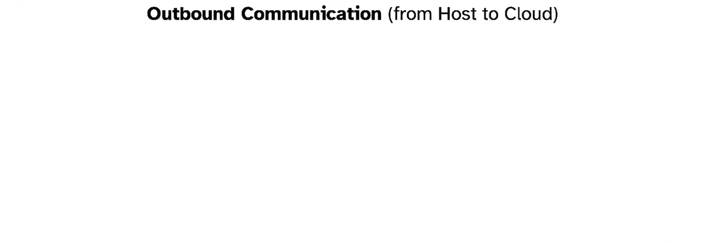

# Introduction to Blues Wirless 📡

**Blues Wireless** provides products and services designed to make it easier for developers to connect their devices to the internet and gather valuable data from various sensors and devices.

Blues wireless featured product is **"Notecard,"** which is a cellular data card designed to simplify IoT device connectivity. The Notecard is a compact and versatile module that can be integrated into various IoT devices, allowing them to communicate with cloud services effortlessly.

#### Key features of the Notecard include:

* **Global Connectivity**: The Notecard supports global cellular connectivity, enabling IoT devices to operate in different regions around the world without requiring separate configurations or network setup.

* **Easy Integration**: Blues Wireless has designed the Notecard to be developer-friendly and easy to integrate with various hardware platforms. It provides libraries and APIs that support popular programming languages, making it accessible to a broad developer community.

* **Data Security**: The Notecard emphasizes data security, offering encryption and authentication mechanisms to safeguard the transmitted information and ensure secure data exchange between devices and the cloud.

* **No Contracts or Data Plans**: Blues Wireless offers a unique approach to data connectivity by providing a simple, pay-as-you-go pricing model for data usage. This allows developers to avoid lengthy contracts or data plans and instead pay only for the data their devices consume.

* **Cloud Integration**: Blues Wireless provides cloud services and APIs that seamlessly integrate with popular cloud platforms, enabling efficient data transfer and management for IoT applications.

In addition to the Notecard, Blues Wireless offers various development kits and accessories to assist developers in building and prototyping their IoT solutions. These kits typically include hardware components and software tools to get started quickly and experiment with different IoT use cases.

## How Blueswirless works?

It's important to understand a few key concepts of the Blues ecosystem:

* **The Notecard** is a device-to-cloud data pump that reduces the complexity of building connected solutions with a secure, reliable cellular or Wi-Fi connection. It's a 30x35 millimeter System-on-Module (SOM) that's ready for embedding into any project.

* **Notecarriers** are development boards that help you get started quickly with the Notecard. There are a variety of Notecarriers designed to fit different needs, and many include onboard Cellular and GPS antennas, as well as a USB port for Serial access to the Notecard.

* **Notehub** is the secure cloud service the Notecard uses to send and receive data. Notehub also provides a console for fleet management and secure connectors for routing data to 3rd party cloud applications.

## The Wi-Fi Notecard 📶

We use blues wirless WiFi notecard to push the ML model infernce from Seeed XIAO to the cloud. With the blues ecosystem, we can impliment it very easily and strightforward. 

We will go through the Notecard and XIAO intergration on the project page, before that please setup an notehub account. 

# ToDo

 - [ ] Create an blues wirless notehub account https://notehub.io/sign-up 

