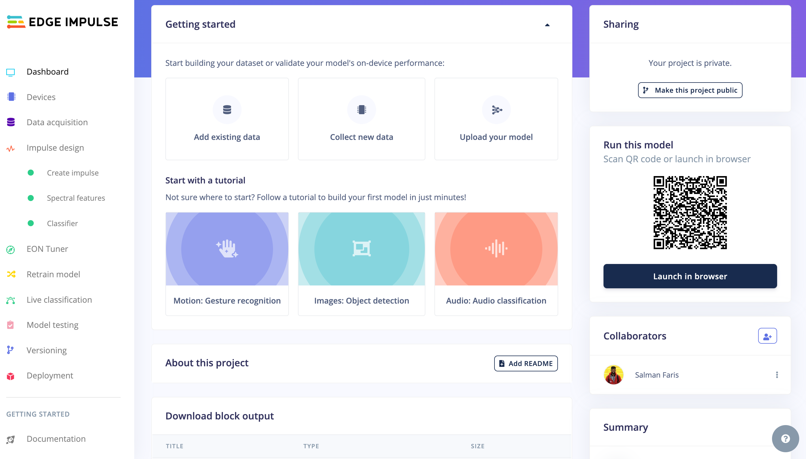
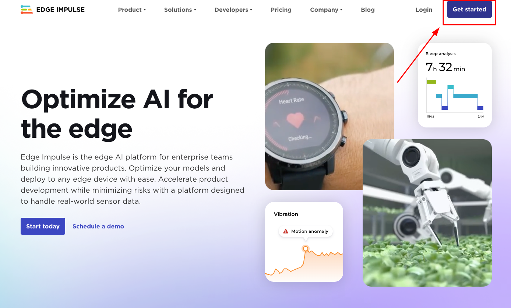

# Introduction to Edge Impulse 💪

Edge Impulse is the leading development platform for machine learning on edge devices, free for developers, and trusted by enterprises worldwide.

* With Edge Impulse, software developers, engineers, and domain experts can solve real problems using machine learning on edge devices without a Ph.D. or advanced embedded engineering skills. From getting started to MLOps in production, Edge Impulse provides maximum efficiency and speed on a wide range of hardware from MCUs to CPUs.  



With EdgeImpulse we can 
* Collect dataset from the device direclty 
* Collect dataset from other source like .zip file, via api or other third party cloud ingestion 
* Create test and train data and put them in different lables  
* Train our model 
* Able to Select approriate ML algoirthms - EI provide recommended ML algorithms based on our dataset
* Deploy it on our harware 
* TinyML project collabration with version controlling 
* and much more that helps you to build tinyML applications. 


## Why we use edge impulse 


We use edge impulse to collect the data, create model, and train using the ML algorithms. It's free and easy to use and it will be generate arduino library so that we can quickly start with prototyping. 


## 📍 Create Edge impulse account 

Vist the [edge impulse signup website](https://studio.edgeimpulse.com/signup) and create an account first, 




## 📍 Install Edge impulse CLI for data ingestion.

This Edge Impulse CLI is used to control local devices, act as a proxy to synchronise data for devices that don't have an internet connection, and to upload and convert local files. The CLI consists of seven tools:

* [edge-impulse-daemon](https://docs.edgeimpulse.com/docs/edge-impulse-cli/cli-daemon) - configures devices over serial, and acts as a proxy for devices that do not have an IP connection.
* [edge-impulse-uploader](https://docs.edgeimpulse.com/docs/edge-impulse-cli/cli-uploader) - allows uploading and signing local files.
* [edge-impulse-data-forwarder](https://docs.edgeimpulse.com/docs/edge-impulse-cli/cli-data-forwarder) - a very easy way to collect data from any device over a serial connection, and forward the data to Edge Impulse.
* [edge-impulse-run-impulse](https://docs.edgeimpulse.com/docs/edge-impulse-cli/cli-run-impulse) - show the impulse running on your device.
* [edge-impulse-blocks](https://docs.edgeimpulse.com/docs/edge-impulse-cli/cli-blocks) - create organizational transformation, custom dsp, custom deployment and custom transfer learning blocks.
* [himax-flash-tool](https://docs.edgeimpulse.com/docs/edge-impulse-cli/himax-flash-tool) - to flash the Himax WE-I Plus


### Installation - Windows
1. Create an [Edge Impulse account](https://studio.edgeimpulse.com/signup).
2. Install [Python 3](https://www.python.org/) on your host computer.
3. Install [Node.js](https://nodejs.org/en/) v14 or higher on your host computer.
    * For Windows users, install the Additional Node.js tools (called Tools for Native Modules on newer versions) when prompted.
4. Install the CLI tools via:
    ``npm install -g edge-impulse-cli --force``

You should now have the tools available in your PATH.

### Installation - Linux, Ubuntu, MacOS, and Raspbian OS

1. Create an [Edge Impulse account](https://studio.edgeimpulse.com/signup).
2. Install [Python 3](https://www.python.org/) on your host computer.
3. Install [Node.js](https://nodejs.org/en/) v14 or higher on your host computer.
Alternatively, run the following commands:
```
curl -sL https://deb.nodesource.com/setup_14.x | sudo -E bash -
sudo apt-get install -y nodejs
node -v
```
The last command should return the node version, v14 or above.
Let's verify the node installation directory:
``npm config get prefix``
If it returns /usr/local/, run the following commands to change npm's default directory:
```
mkdir ~/.npm-global
npm config set prefix '~/.npm-global'
echo 'export PATH=~/.npm-global/bin:$PATH' >> ~/.profile
```
On MacOS you might be using zsh as default, so you will want to update the correct profile
```
mkdir ~/.npm-global
npm config set prefix '~/.npm-global'
echo 'export PATH=~/.npm-global/bin:$PATH' >> ~/.zprofile
```
4. Install the CLI tools via:
``npm install -g edge-impulse-cli``
You should now have the tools available in your PATH.

For more details, check here https://docs.edgeimpulse.com/docs/edge-impulse-cli/cli-installation. 

# ToDo

 - [ ] Create edge impulse account. https://studio.edgeimpulse.com/signup 
 - [ ] Install edgeimpulse cli on you computer. 