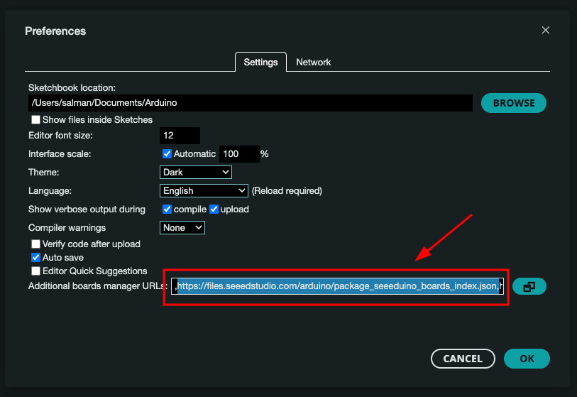
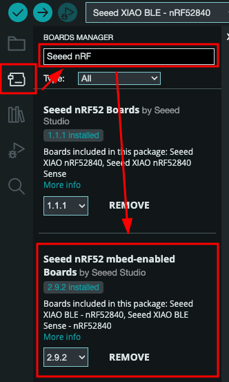
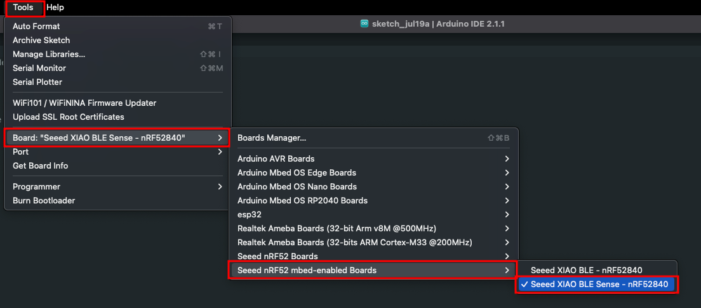
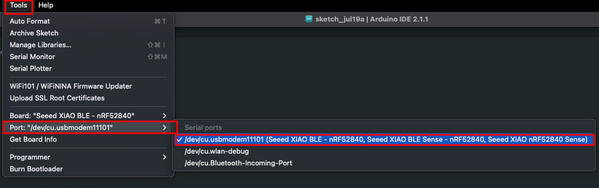
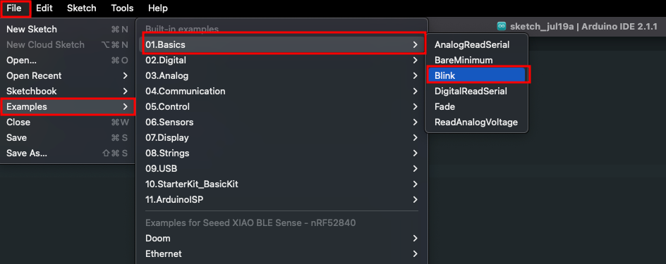
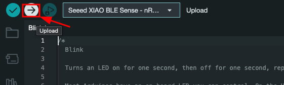

# Seeed XIAO nRF52840 Sense 🍀

Seeed Studio XIAO nRF52840 is equipped with a powerful **Nordic nRF52840 MCU** which integrates Bluetooth 5.0 connectivity. Meanwhile, it has a small and exquisite form-factor which can be used for wearable devices and Internet of Things projects. The single-sided surface-mountable design and the onboard Bluetooth antenna can greatly facilitate the rapid deployment of IoT projects.

We are using the Seeed **Studio XIAO nRF52840 Sense** for the tinyML workshop. It is integrated with two extra onboard sensors. One of them is a **Pulse Density Modulation (PDM) Digital Microphone**. It can receive audio data in real-time which allows it to be used for audio recognition. The other one is a **6-axis Inertial Measurement Unit (IMU)**, this IMU can be very useful in TinyML projects like gesture recognition. These onboard sensors provide a great convenience for users while the board is ultra-small.

## Features
* Powerful wireless capabilities: Bluetooth 5.0 with onboard antenna
* Powerful CPU: Nordic nRF52840, ARM® Cortex®-M4 32-bit processor with FPU, 64 MHz
* Ultra-Low Power: Standby power consumption is less than 5μA
* Battery charging chip: Supports lithium battery charge and discharge management
* Onboard 2 MB flash
* Onboard PDM microphone (only in Seeed Studio XIAO nRF52840 Sense)
* Onboard 6-axis LSM6DS3TR-C IMU (only in Seeed Studio XIAO nRF52840 Sense)
* Ultra Small Size: 20 x 17.5mm, Seeed Studio XIAO series classic form-factor for wearable devices
* Rich interfaces: 1xUART, 1xI2C, 1xSPI, 1xNFC, 1xSWD, 11xGPIO(PWM), 6xADC
* Single-sided components, surface mounting design.

##  📍 Install the Seeed XIAO nRF52840 Sense on Arduino IDE

#### Step 1: Install Arduino IDE v2.1.1 in your computer from here https://www.arduino.cc/en/software 
#### Step 2: Add Seeed Studio XIAO nRF52840 (Sense) board package to your Arduino IDE

Navigate to File > Preferences, and fill "Additional Boards Manager URLs" with the url below: ``https://files.seeedstudio.com/arduino/package_seeeduino_boards_index.json``

Navigate to Tools > Board > Boards Manager..., type the keyword "seeed nrf52" in the search box, select the latest version of the board you want, and install it. You can install both.

#### Step 3: Select Seeed XIAO n0F52849 Sense board 

After installing the board package, navigate to Tools > Board and choose the board you want, continue to select "Seeed XIAO nRF52840 Sense". Now we have finished setting up the Seeed Studio XIAO nRF52840 (Sense) for Arduino IDE.

#### Step 4: Select Correct Port 

Navigate to **Tools > Port** and select the serial port name of the connected Seeed Studio XIAO nRF52840 (Sense). This is likely to be COM3 or higher if use a Windows OS (COM1 and COM2 are usually reserved for hardware serial ports) or it will be as below image. 

## 📍 Run Blink sketch on Seeed XIAO nRF52840 Sense

To make sure the board installation and board looks good, we can try to run a program to blink onboard LED from the XIAO as hello world program and test. 

#### Step 1: Open Blink Sketch from example 

Navigate to File > Examples > 01.Basics > Blink to open Blink example. 

#### Step 2: Upload program to the Board 

Click the Upload button to upload the Blink example code to the board. 

Once uploaded, you will see the built-in red LED blinking with a 1-second delay between each blink. This means the connection is successful 🎉 and now you can got to the next session. 

# ToDo

 - [ ] Install Seeed XIAO nRF52840 on Arduino IDE. 
 - [ ] Connect board with computer and select correct port. 
 - [ ] Upload blink sketch to the board without errors. 

