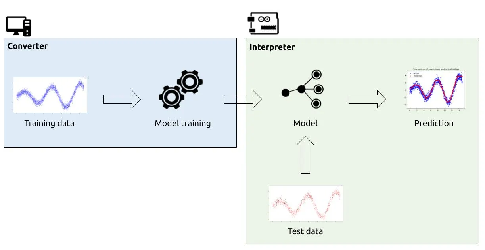

# Introduction to tinyML 💪 + 🧠

Welcome to tinyML Workshop, In here we will look into basic of ML and tinyML. Feel do [PR](https://github.com/MakerGram/workshops) to improve the doc.

### What is Machine learning?

Machine learning (ML) is a way of writing computer programs. Specifically, it’s a way of writing programs that process raw data and turn it into information that is meaningful at an application level.

<iframe src="https://docs.google.com/presentation/d/e/2PACX-1vRoNieVwXZl5x2H3k-8hAxuYs-X58Sbo5dSiXJhQxcF93FZ3hotvjPcECiZcbg-Vwgpc1rmOQjCwNC1/embed?start=false&loop=false&delayms=15000" frameborder="0" width="960" height="569" allowfullscreen="true" mozallowfullscreen="true" webkitallowfullscreen="true"></iframe>

For example, one ML program might be designed to determine when an industrial machine has broken down based on readings from its various sensors, so that it can alert the operator. Another ML program might take raw audio data from a microphone and determine if a word has been spoken, so it can activate a smart home device.

Unlike normal computer programs, the rules of ML programs are not determined by a developer. Instead, ML uses specialized algorithms to learn rules from data, in a process known as training.

###  Where can machine learning help?

Machine learning is an excellent tool for solving problems that involve **pattern recognition**, especially patterns that are complex and might be difficult for a human observer to identify. ML algorithms excel at turning messy, high-bandwidth raw data into usable signals, especially combined with conventional signal processing.

But ML is not always the best tool for the job. If the rules of a system are well defined and can be easily expressed with hard-coded logic, it’s usually more efficient to work that way.

### Limitations of machine learning

Machine learning algorithms are powerful tools, but they can have the following drawbacks:
* They output estimates and approximations, not exact answers
* ML models can be computationally expensive to run
* Training data can be time consuming and expensive to obtain

It can be tempting to try and apply ML everywhere—but if you can solve a problem without ML, it is usually better to do so.

## What is embedded ML?

<iframe src="https://docs.google.com/presentation/d/e/2PACX-1vQ6edxSKFZSjDa2FXCnnThKWLVfhkU8xe1FQV0UkIAHU5bE_sCvSfJ57JZj5qj5HsH8kxYRT9QCShg0/embed?start=false&loop=false&delayms=15000" frameborder="0" width="960" height="569" allowfullscreen="true" mozallowfullscreen="true" webkitallowfullscreen="true"></iframe>

Recent advances in microprocessor architecture and algorithm design have made it possible to run sophisticated machine learning workloads on even the smallest of microcontrollers. Embedded machine learning, also known as TinyML, is the field of machine learning when applied to embedded systems such as these.

There are some major advantages to deploying ML on embedded devices. The key advantages are neatly expressed in the unfortunate acronym BLERP, [coined by Jeff Bier](https://www.eetimes.com/ai-and-vision-at-the-edge/). They are:

* **Bandwidth—ML** algorithms on edge devices can extract meaningful information from data that would otherwise be inaccessible due to bandwidth constraints.
* **Latency—On-device** ML models can respond in real-time to inputs, enabling applications such as autonomous vehicles, which would not be viable if dependent on network latency.
* **Economics—By processing** data on-device, embedded ML systems avoid the costs of transmitting data over a network and processing it in the cloud.
* **Reliability—Systems** controlled by on-device models are inherently more reliable than those which depend on a connection to the cloud.
* **Privacy—When data** is processed on an embedded system and is never transmitted to the cloud, user privacy is protected and there is less chance of abuse.

Src: docs.edgeimpulse.com

###  How it's works?

 (📷src:eonardocavagnis.medium.com)

The machine learning model be created and training will be done with the help of powerful computer which can run the ML alogorthams to make the model training happen, After that model inferencing will be happening on the tinyML device of our choice. The above image give an better understanding.

In the following sessions, we will learn about every steps involved in tht tinyML model creation and running, Please stay tuned!

# ToDo

 - [ ] Read the full documentation about "Introduction about tinyML"
 - [ ] Share an idea that you have in your mind where can use the tinyML to solve a problem.

