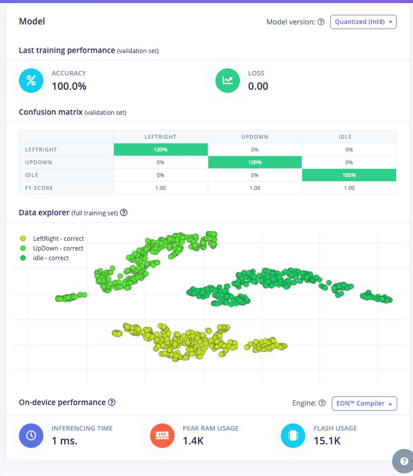
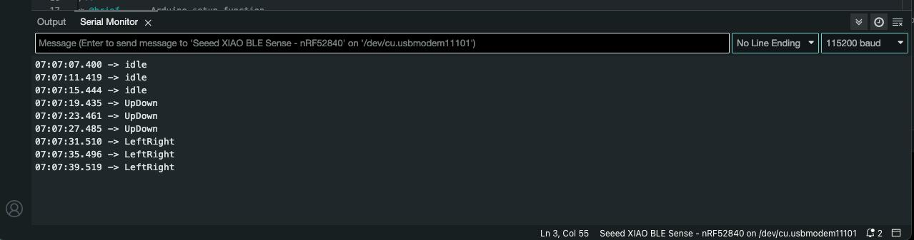

# Harry Potter Magic Wand 🧙‍♂️🪄


# Who Love Magic? 🙋🙋‍♀️

In the enchanting world of Harry Potter, wands 🪄 are more than just tools; they are extensions of the wizards who wield them, capable of casting spells that bewitch minds, conjure beauty, and occasionally wreak havoc. What if the boundary between that magical realm and our own could be blurred? What if, with a flick of the wrist and a well-pronounced incantation, you could command the unseen forces of our world much like a wizard in Hogwarts? 🧙‍♀️ This isn't just a flight of fancy but a project that bridges the gap between the fantastical and the tangible through the marvels of modern technology.

Enter the realm of magic with a twist of science as we embark on a journey to create a Harry Potter-style magic wand. This isn't any ordinary wand; it's powered by the cutting-edge **Seeed XIAO nRF52840 Sense** , a microcontroller that's small in size but vast in potential, combined with the intelligence of **Edge Impulse**, a leading platform in machine learning for edge devices. Together, they form the heart and soul of our wand, enabling it to recognize gestures and cast spells in a way that would make even the most skilled wizards pause in awe.


Imagine lighting up a room with a "Lumos" spell, sending objects flying with a flick for "Wingardium Leviosa", or even changing the color of LEDs to match your house colors—all with a simple movement of your hand-crafted wand. This project will guide you through the magical process of creating such a wand. From gathering the necessary components like accelerometers and LEDs, to training a machine learning model to recognize your spell-casting gestures, you'll learn how to bring a piece of the wizarding world into reality.

So grab your cloaks, prepare your potions, and let's dive into a project where the worlds of magic and technology collide, creating something truly magical. Whether you're a fan of Harry Potter, a DIY electronics enthusiast, or someone fascinated by the potential of machine learning, this journey promises to be an exciting adventure into the heart of magic itself.


## Key Features of Harry Potter Magic Wand 🧙‍♂️🪄

* **Gesture Recognition** 🌀: Utilizes machine learning models trained via Edge Impulse to recognize specific wand movements, allowing the wielder to cast* spells by performing accurate gestures.
* **Control Internet of things 📡**: With the modern Magic wand, we can control Internet of things devices and talk to system such as Laptop and Mobile phone.
* **Bluetooth Capability 🛜** : Allows the wand to connect to smartphones, tablets, or other smart devices for extended functionalities, such as controlling smart home devices or playing sounds through external speakers.
* **Open Source Software 💻**: Users can update the wand with new spells and gestures, thanks to the open-source nature of the software. The community can contribute to its spell library, making the wand's capabilities ever-expanding.
* **DIY Aesthetics 🛠️:** The wand can be customized in its physical appearance to match the user's preference, whether it be a replica of a wand from the Harry Potter series or an original design.
* **Learn Through Play 📚:** Bridges the gap between entertainment and education, teaching principles of electronics, programming, and machine learning through interactive spell casting.


## Flow Diagram 🔖 / How it's works.


## Demo 🗃️


---

## Let's get started ✨


## Pre-requisites

### Hardware Requirements 🔩

* Seeed XIAO nRF52840 Sense
* Type-C Cable
* Laptop/Desktop computer
* Magic Wand (Chopsticks)

### Software Installations 💻

Attendees only need some very basic knowledge of Arduino development and understanding of 101-level C coding concepts. Some (free) software installations are required:

* Arduino IDE
* Install the Edge Impulse CLI
* Create a free Edge Impulse Studio account


### Workshop Agenda  📖

All of the resources needed to present the workshop are available in the venue. Please let us know if anything missing.

* Welcome and Introductions **[5 mins]**
* Introduce the Seeed XIAO nRF52840 Hardware **[10 mins]**
* Introduce the Edge Impulse platform **[10 mins]**
* Hands-on: XIAO blink **[15 mins]**
* Hands-on: XIAO IMU Data Forwarding to Edge Impulse **[15 mins]**
* hands-on: Create Impulse and Deploy **[15 mins]**
* hands-on: Build and run inference program on XIAO **[15 mins]**
* Hands-on: Complete the Action program based on the inference **[15 mins]**
* Hands-on: Assembling everything togther **[20 mins]**
* Hands-on: Test  **[10 mins]**


---

## Step 1: Introductions 🔖

1. [Introduction to TinyML 💪 + 🧠](../../docs/tiny-ml-workshop/intro)
2. [Introduction to Arduino ♾️](../../docs/tiny-ml-workshop/introductionToArduino) => Install Arduino IDE
3. [Introduction to XIAO nRF52840 Sense 🍀](../../docs/tiny-ml-workshop/IntroductionToXiao) => Install XIAO on Arduino , run blink project.
4. [Introduction to EdgeImpulse 💪](../../docs/tiny-ml-workshop/IntroductionToEdgeImpulse) => Create Edge Impulse account.

---


Note : [Files](https://drive.google.com/drive/folders/1QLyKkKOwmpsVop3beFmxr5DbuMFKjSsU?usp=sharing)


## Step 2: Fetch Accelerometer data from XIAO 🧺

Next, we need to read the Accelerometer data from the XIAO inbuilt Accelerometer senseor. For that please follow the below guide.

### Step 2.1: Connect the Seeed Studio XIAO nRF52840 Sense to your computer via a USB Type-C cable.


### Step 2.2: Upload ReadXIAOAccelerometer.ino sketch

```
// XIAO BLE Sense LSM6DS3 Data  Forwarder

#include "LSM6DS3.h"
#include "Wire.h"

//Create a instance of class LSM6DS3
LSM6DS3 myIMU(I2C_MODE, 0x6A);  //I2C device address 0x6A

#define CONVERT_G_TO_MS2 9.80665f
#define FREQUENCY_HZ 50
#define INTERVAL_MS (1000 / (FREQUENCY_HZ + 1))

static unsigned long last_interval_ms = 0;


void setup() {
  Serial.begin(115200);
  while (!Serial)
    ;

  if (myIMU.begin() != 0) {
    Serial.println("Device error");
  } else {
    Serial.println("Device OK!");
  }
}


void loop() {
  if (millis() > last_interval_ms + INTERVAL_MS) {
    last_interval_ms = millis();
    Serial.print(myIMU.readFloatAccelX() * CONVERT_G_TO_MS2, 4);
    Serial.print('\t');
    Serial.print(myIMU.readFloatAccelY() * CONVERT_G_TO_MS2, 4);
    Serial.print('\t');
    Serial.println(myIMU.readFloatAccelZ() * CONVERT_G_TO_MS2, 4);
  }
}

```

Upload the code to your XIAO Sense and open the serial monitor or serial plotter to see the accelerometer data.

### Step 2.3: Install the XIAO to the Magic Wand provided.

<!-- Insert Magic Wand Image here -->


Install the band on your hand as mentioned on the above image and then move you Magic Wand after open the Serial monitor or Serial plotter.


You can also see the data over the Serial Plotter.


---

## Step 3: Connect to Edge impulse and Forward Accelerometer data  🎛️.

As of now, we can see the accelerometer data from from the XIAO using arduino IDE serial monitor, now we need to forward the data to the edge impulse for post processing.

### Step 3.1: Create an Edge Impulse Free Account.

First, we need to create an edge impulse account. for that go to https://studio.edgeimpulse.com/login select **Sign Up**, or if you already have an account enter **Username/Email** and **password**.


### Step 3.2: Create Edge Impulse Project

After creating an account, we need to create an edgeImpulse project. For that click your profile and select Create a new project or use this [URL](https://studio.edgeimpulse.com/studio/select-project#create-new-project).


Then provide a project name, then click **Create new project** .


Next, you can see the studio page, which means you successfully created an edge Impulse project 🎉


## Step 4: Connect the XIAO with EdgeImpulse and start collect data 🪣.

Next, we need to connect the XIAO with the edge impulse to collect the data, and for that you need follow the below steps.

### Steps 4.1: Install Edge impulse CLI in your computer.

This Edge Impulse CLI is used to control local devices, act as a proxy to synchronise data for devices that don't have an internet connection, and to upload and convert local files. The CLI consists of seven tools:

* [edge-impulse-daemon](https://docs.edgeimpulse.com/docs/edge-impulse-cli/cli-daemon) - configures devices over serial, and acts as a proxy for devices that do not have an IP connection.
* [edge-impulse-uploader](https://docs.edgeimpulse.com/docs/edge-impulse-cli/cli-uploader) - allows uploading and signing local files.
* [edge-impulse-data-forwarder](https://docs.edgeimpulse.com/docs/edge-impulse-cli/cli-data-forwarder) - a very easy way to collect data from any device over a serial connection, and forward the data to Edge Impulse.
* [edge-impulse-run-impulse](https://docs.edgeimpulse.com/docs/edge-impulse-cli/cli-run-impulse) - show the impulse running on your device.
* [edge-impulse-blocks](https://docs.edgeimpulse.com/docs/edge-impulse-cli/cli-blocks) - create organizational transformation, custom dsp, custom deployment and custom transfer learning blocks.
* [himax-flash-tool](https://docs.edgeimpulse.com/docs/edge-impulse-cli/himax-flash-tool) - to flash the Himax WE-I Plus


#### Installation - Windows
1. Create an [Edge Impulse account](https://studio.edgeimpulse.com/signup).
2. Install [Python 3](https://www.python.org/) on your host computer.
3. Install [Node.js](https://nodejs.org/en/) v14 or higher on your host computer.
    * For Windows users, install the Additional Node.js tools (called Tools for Native Modules on newer versions) when prompted.
4. Install the CLI tools via:
    ``npm install -g edge-impulse-cli --force``

You should now have the tools available in your PATH.

#### Installation - Linux, Ubuntu, MacOS, and Raspbian OS

1. Create an [Edge Impulse account](https://studio.edgeimpulse.com/signup).
2. Install [Python 3](https://www.python.org/) on your host computer.
3. Install [Node.js](https://nodejs.org/en/) v14 or higher on your host computer.
Alternatively, run the following commands:
```
curl -sL https://deb.nodesource.com/setup_14.x | sudo -E bash -
sudo apt-get install -y nodejs
node -v
```
The last command should return the node version, v14 or above.
Let's verify the node installation directory:
``npm config get prefix``
If it returns /usr/local/, run the following commands to change npm's default directory:
```
mkdir ~/.npm-global
npm config set prefix '~/.npm-global'
echo 'export PATH=~/.npm-global/bin:$PATH' >> ~/.profile
```
On MacOS you might be using zsh as default, so you will want to update the correct profile
```
mkdir ~/.npm-global
npm config set prefix '~/.npm-global'
echo 'export PATH=~/.npm-global/bin:$PATH' >> ~/.zprofile
```
4. Install the CLI tools via:
``npm install -g edge-impulse-cli``
You should now have the tools available in your PATH.

For more details, check here https://docs.edgeimpulse.com/docs/edge-impulse-cli/cli-installation.

### Steps 4.2: Connect the XIAO to the Edge Impulse project we created

We need to connect the XIAO board to a specific project. For that, follow th steps after installing the edge impulse CLI

Enter the command ``edge-impulse-data-forwarder`` CLI to start the data forwarder and provide the information. It's similar to below image


 1. Run command ``edge-impulse-data-forwarder``
 2. Enter edge impulse account email account
 3. Enter edge impulse account password
 4. Select project from the list.

After selecting the project, we need to describe the data as below.


 1. Name the sensor values as ```accX,accY,accZ```

That's all, then open the Edge impulse project page, you can see the device connected there.

### Step 4.3 Start collecting Data.


After following the step 4.2, we can see the device connected to the edge impulse and we can see it's listed as above image.


Choose **Data Aquisition** option and provide the **lable** of data we are collecting and click start **"Start Sampling"**, For this project we are collecting data for **idle** , **LeftRight** and **UpDown** activities for simplicity. Try to collect as much data as possible.

 You can see that label is 'LeftRight' so I need to record Left Right Movement data from the sensor parameters.


 After that click sample, since we provided 10000 milliseconds as sample length, it will start with10-sec Built-in Accelerometer data.


 So when sampling started, you should do the activity for 10 seconds to capture the data. Another option is you can also import the pre-captured data. For that, first download the dataset by clicking [here](../tiny-ml-workshop/img/magicwand/xiao-nrf-magicwand-presenter-export.zip)


#### Upload the dataset

Select the **Upload data** option.

Make sure to select the exact settings as mentiond on the above image and then choose the file that you alredy downloaded from  [here](../tiny-ml-workshop/src/activitymonitor_xiao_sense-export.zip).

After collecting or importing the data, you can see the inspect the Raw data. Like this


LeftRight data like below.


## Step 5 Design Impulse, create ML model and train 🪄.

An impulse takes the raw data, slices it up in smaller windows, uses signal processing blocks to extract features, and then uses a learning block to classify new data.

Signal processing blocks always return the same values for the same input and are used to make raw data easier to process, while learning blocks learn from past experiences.

In our Impulse Design, There are three steps we need to take care

* Create Impulse - Select Data series, processing block, learning block and output features
* Select & Build Processing block (Spectral Features)
* Select & Build Learning block (Neural Network Classifiers)

### Step 5.1 Create Impulse

First, we need to select the parameters such as window size in the data series,processing block and learning block Finlay select the Output features which is labels.


1. **Time series data**: We need to mention the data we are using for the model, here we are using **accX**,**accY** and **accZ** values, and put **Window size** as **2000ms** , **Window increase** as **200ms**, then finally FREQ as 50 Hz. Pleas refer the image.
    * The **window size** is the size of the raw features that is used for the training
    * The **window increase **is used to artificially create more features (and feed the learning block with more information)
    * The** frequency** is automatically calculated based on your training samples. You can modify this value but you currently cannot use values lower than 0.000016 (less than 1 sample every 60s).
    * **Zero-pad data**: Adds zero values when raw feature is missing
2. **Processing Block => Spectral Analysis**: Extracting meaningful features from your data is crucial to building small and reliable machine learning models, and in Edge Impulse this is done through processing blocks. Here for the project we are using the **Spectral Analysis**.

3. **Learning Block => Classfication**: After extracting meaningful features from the raw signal using signal processing, you can now train your model using a learning block. We are using **Classfication** Learning Block .

4. **Output Features:** Here we can see the output from the Impulse, it's will be the product of the ML prediction. Here we can see the values as "**Sitting**" , "**Standing**", "**Walking**".

### Step 5.2 Spectral features

The Spectral features block extracts frequency, power and other characteristics of a signal. Low-pass and high-pass filters can also be applied to filter out unwanted frequencies. It is great for analyzing repetitive patterns in a signal, such as movements or vibrations from an accelerometer. It is also great for complex signals that have transients or irregular waveform, such as ECG and PPG signals.


Edge Impulse will slide the window over your sample, as given by the time series input block parameters during Impulse creation in order to generate several training/test samples from your longer time series sample.
* **Scale axes** - Multiply all raw input values by this number.
* **Input decimation ratio** - Decimating (downsampling) the signal reduces the number of features and improves frequency resolution in relevant bands without increasing resource usage.
* **Type** - The type of filter to apply to the raw data (low-pass, high-pass, or none).
* **Cut-off frequency** - Cut-off frequency of the filter in hertz. Also, this will remove unwanted frequency bins from the generated features.
* **Order** - Order of the Butterworth filter. Must be an even number. A higher order has a sharper cutoff at the expense of latency. You can also set to zero, in which case, the signal won't be filtered, but unwanted frequency bins will still be removed from the output.

For now, we don't need chanage any paramters, Just click **Save paramters** and continue.


### Step 5.3 Classifier

Here we are giving parameters to setup the out Neural Network. For this project, we don't need to chanage anaything and we can start trainig by clicking "**Start Training**"


it will take few minutes from 5 to 10 minutes, please wait untill the training is completed.

We can see the model training performance once training completed.




here we got a very good performance result, everything looks good so far 🥳.


## Step 6: Generate Arduino Library 🧬.
We successfully collected data and trained our tinyML model, now we can impliment it on our XIAO and make it action. To use the tinyML model, we can download tinyML project as arduino library, for that

1. Go to "**Deployment**"
2. Serach for "**Arduino Library**"
3. Click **Build**


The process will take little bit time, so please wait untill the library is generated.

## Step 7: Deploy it on the XIAO nRF52850 Sense and Live infernce 🪢.

Once the library generated, we need to add it on the arduino as new library for that, choose **Add .ZIP Libry** from the **Include Library** option from **Sketch**.


After, adding the library. Use below code or download the code from [here](../tiny-ml-workshop/src/XIAO_Sense_Activity_Monitor_v1/XIAO_Sense_Activity_Monitor_v1.ino).


```

/* Includes ---------------------------------------------------------------- */
#include <ActivityMonitor_Xiao_Sense_inferencing.h> //replace the library name with yours
#include "LSM6DS3.h"

/* Constant defines -------------------------------------------------------- */
#define CONVERT_G_TO_MS2    9.80665f
#define MAX_ACCEPTED_RANGE  2.0f        // starting 03/2022, models are generated setting range to +-2, but this example use Arudino library which set range to +-4g. If you are using an older model, ignore this value and use 4.0f instead
#define INTERVAL_MS (1000 / (FREQUENCY_HZ + 1))
static unsigned long last_interval_ms = 0;

LSM6DS3 myIMU(I2C_MODE, 0x6A);  //I2C device address 0x6A

static bool debug_nn = false; // Set this to true to see e.g. features generated from the raw signal

/**
* @brief      Arduino setup function
*/
void setup()
{
    // put your setup code here, to run once:
    Serial.begin(115200);
    // comment out the below line to cancel the wait for USB connection (needed for native USB)
    while (!Serial);
    Serial.println("Edge Impulse Inferencing Demo");

    if (!myIMU.begin()) {
        ei_printf("Failed to initialize IMU!\r\n");
    }
    else {
        ei_printf("IMU initialized\r\n");
    }

    if (EI_CLASSIFIER_RAW_SAMPLES_PER_FRAME != 3) {
        ei_printf("ERR: EI_CLASSIFIER_RAW_SAMPLES_PER_FRAME should be equal to 3 (the 3 sensor axes)\n");
        return;
    }
}

/**
 * @brief Return the sign of the number
 *
 * @param number
 * @return int 1 if positive (or 0) -1 if negative
 */
float ei_get_sign(float number) {
    return (number >= 0.0) ? 1.0 : -1.0;
}

/**
* @brief      Get data and run inferencing
*
* @param[in]  debug  Get debug info if true
*/
void loop()
{
    //ei_printf("\nStarting inferencing in 2 seconds...\n");

    delay(2000);

    //ei_printf("Sampling...\n");

    // Allocate a buffer here for the values we'll read from the IMU
    float buffer[EI_CLASSIFIER_DSP_INPUT_FRAME_SIZE] = { 0 };

    for (size_t ix = 0; ix < EI_CLASSIFIER_DSP_INPUT_FRAME_SIZE; ix += 3) {
        // Determine the next tick (and then sleep later)
        uint64_t next_tick = micros() + (EI_CLASSIFIER_INTERVAL_MS * 1000);

        //IMU.readAcceleration(buffer[ix], buffer[ix + 1], buffer[ix + 2]);

        buffer[ix+0] = myIMU.readFloatAccelX();
        buffer[ix+1] = myIMU.readFloatAccelY();
        buffer[ix+2] = myIMU.readFloatAccelZ();


        for (int i = 0; i < 3; i++) {
            if (fabs(buffer[ix + i]) > MAX_ACCEPTED_RANGE) {
                buffer[ix + i] = ei_get_sign(buffer[ix + i]) * MAX_ACCEPTED_RANGE;
            }
        }

        buffer[ix + 0] *= CONVERT_G_TO_MS2;
        buffer[ix + 1] *= CONVERT_G_TO_MS2;
        buffer[ix + 2] *= CONVERT_G_TO_MS2;

        delayMicroseconds(next_tick - micros());
    }

    // Turn the raw buffer in a signal which we can the classify
    signal_t signal;
    int err = numpy::signal_from_buffer(buffer, EI_CLASSIFIER_DSP_INPUT_FRAME_SIZE, &signal);
    if (err != 0) {
        ei_printf("Failed to create signal from buffer (%d)\n", err);
        return;
    }

    // Run the classifier
    ei_impulse_result_t result = { 0 };

    err = run_classifier(&signal, &result, debug_nn);
    if (err != EI_IMPULSE_OK) {
        ei_printf("ERR: Failed to run classifier (%d)\n", err);
        return;
    }

    // print the predictions
   // ei_printf("Predictions ");
   // ei_printf("(DSP: %d ms., Classification: %d ms., Anomaly: %d ms.)",
   // result.timing.dsp, result.timing.classification, result.timing.anomaly);
    //ei_printf("\n");
    for (size_t ix = 0; ix < EI_CLASSIFIER_LABEL_COUNT; ix++) {
   // ei_printf("    %s: %.5f\n", result.classification[ix].label, result.classification[ix].value);
    if (result.classification[ix].value > .5) {
        ei_printf("%s \n", result.classification[ix]);
    }
    }

    //  if (result.classification[ix].value > .5) {
    //     ei_printf("    %s: %.5f\n", result.classification[ix].label, result.classification[ix].value);
    // }
    // }


#if EI_CLASSIFIER_HAS_ANOMALY == 1
    ei_printf("anomaly score: %.3f\n", result.anomaly);
#endif
}

#if !defined(EI_CLASSIFIER_SENSOR) || EI_CLASSIFIER_SENSOR != EI_CLASSIFIER_SENSOR_ACCELEROMETER
#error "Invalid model for current sensor"
#endif

```

From the above code, replace the ``#include <ActivityMonitor_Xiao_Sense_inferencing.h>`` replace your library name here and upload to the XIAO.

Now you can see the your body action inferencing by the tinyML model running on the XIAO and display the prediction on the Serial monitor.




### Congratulation, you made the tinyML project and implemented it on the XIAO BLE Sense. 🥳


## Step 7: Setup an Action ✨

We have a magic wand that can detect movements, and now we need to set up an action that will be executed when a specific movement is recognized. For instance, if we move the wand up and down, we can change the slide shown in the demonstration. Let's explore how to achieve this functionality.

For the slide changer, you are utilizing the USB HID protocol to send keyboard strokes from the XIAO board to the computer when it detects an up or down motion. Essentially, the XIAO acts as a keyboard and sends commands only when the predefined conditions are met.

### Step 7.1: Upload the Action code.

```
/* Includes ---------------------------------------------------------------- */
#include <Xiao-nRF-MagicWand-Presenter_inferencing.h>  //replace the library name with yours
#include "LSM6DS3.h"
#include "PluggableUSBHID.h"
#include "USBKeyboard.h"

USBKeyboard keyboard;  //HID

/* Constant defines -------------------------------------------------------- */
#define CONVERT_G_TO_MS2 9.80665f
#define MAX_ACCEPTED_RANGE 2.0f  // starting 03/2022, models are generated setting range to +-2, but this example use Arudino library which set range to +-4g. If you are using an older model, ignore this value and use 4.0f instead
#define INTERVAL_MS (1000 / (FREQUENCY_HZ + 1))
static unsigned long last_interval_ms = 0;

LSM6DS3 myIMU(I2C_MODE, 0x6A);  //I2C device address 0x6A

static bool debug_nn = false;  // Set this to true to see e.g. features generated from the raw signal

/**
* @brief      Arduino setup function
*/
void setup() {
  // put your setup code here, to run once:
  Serial.begin(115200);
  // comment out the below line to cancel the wait for USB connection (needed for native USB)
  // while (!Serial)
  //   ;
  Serial.println("Edge Impulse Inferencing Demo");

  if (!myIMU.begin()) {
    ei_printf("Failed to initialize IMU!\r\n");
  } else {
    ei_printf("IMU initialized\r\n");
  }

  if (EI_CLASSIFIER_RAW_SAMPLES_PER_FRAME != 3) {
    ei_printf("ERR: EI_CLASSIFIER_RAW_SAMPLES_PER_FRAME should be equal to 3 (the 3 sensor axes)\n");
    return;
  }
}

/**
 * @brief Return the sign of the number
 *
 * @param number
 * @return int 1 if positive (or 0) -1 if negative
 */
float ei_get_sign(float number) {
  return (number >= 0.0) ? 1.0 : -1.0;
}

/**
* @brief      Get data and run inferencing
*
* @param[in]  debug  Get debug info if true
*/
void loop() {
  //ei_printf("\nStarting inferencing in 2 seconds...\n");

  //delay(2000);

  //ei_printf("Sampling...\n");

  // Allocate a buffer here for the values we'll read from the IMU
  float buffer[EI_CLASSIFIER_DSP_INPUT_FRAME_SIZE] = { 0 };

  for (size_t ix = 0; ix < EI_CLASSIFIER_DSP_INPUT_FRAME_SIZE; ix += 3) {
    // Determine the next tick (and then sleep later)
    uint64_t next_tick = micros() + (EI_CLASSIFIER_INTERVAL_MS * 1000);

    //IMU.readAcceleration(buffer[ix], buffer[ix + 1], buffer[ix + 2]);

    buffer[ix + 0] = myIMU.readFloatAccelX();
    buffer[ix + 1] = myIMU.readFloatAccelY();
    buffer[ix + 2] = myIMU.readFloatAccelZ();


    for (int i = 0; i < 3; i++) {
      if (fabs(buffer[ix + i]) > MAX_ACCEPTED_RANGE) {
        buffer[ix + i] = ei_get_sign(buffer[ix + i]) * MAX_ACCEPTED_RANGE;
      }
    }

    buffer[ix + 0] *= CONVERT_G_TO_MS2;
    buffer[ix + 1] *= CONVERT_G_TO_MS2;
    buffer[ix + 2] *= CONVERT_G_TO_MS2;

    delayMicroseconds(next_tick - micros());
  }

  // Turn the raw buffer in a signal which we can the classify
  signal_t signal;
  int err = numpy::signal_from_buffer(buffer, EI_CLASSIFIER_DSP_INPUT_FRAME_SIZE, &signal);
  if (err != 0) {
    ei_printf("Failed to create signal from buffer (%d)\n", err);
    return;
  }

  // Run the classifier
  ei_impulse_result_t result = { 0 };

  err = run_classifier(&signal, &result, debug_nn);
  if (err != EI_IMPULSE_OK) {
    ei_printf("ERR: Failed to run classifier (%d)\n", err);
    return;
  }

  int pred_index = 0;    // Initialize pred_index
  float pred_value = 0;  // Initialize pred_value


  //print the predictions
  // ei_printf("Predictions ");
  // ei_printf("(DSP: %d ms., Classification: %d ms., Anomaly: %d mss.)",
  // result.timing.dsp, result.timing.classification, result.timing.anomaly);
  // ei_printf("\n");
  for (size_t ix = 0; ix < EI_CLASSIFIER_LABEL_COUNT; ix++) {
    // ei_printf("    %s: %.5f\n", result.classification[ix].label, result.classification[ix].value);
    // if (result.classification[ix].value > .5) {
    //ei_printf("%s \n", result.classification[ix]);

    if (result.classification[ix].value > pred_value) {
      pred_index = ix;
      pred_value = result.classification[ix].value;
    }
    //}

    //  if (result.classification[ix].value > .5) {
    //     ei_printf("    %s: %.5f\n", result.classification[ix].label, result.classification[ix].value);
    // }
  }


  // 0 - LeftRight:
  // 1 -  UpDown:
  // 2-   idle:

  // Display inference result
  if ((pred_index == 0 && (pred_value > 0.6))) {
    Serial.println("it's Left and Right Motion");
    keyboard.key_code(LEFT_ARROW);
  } else if ((pred_index == 1) && (pred_value > 0.6)) {
    Serial.println("it's Up and Down Motion");
    keyboard.key_code(RIGHT_ARROW);
  } else if ((pred_index == 2) && (pred_value > 0.6)) {
    Serial.println("Idle");
  } else {
    //nothing to do.
  }


#if EI_CLASSIFIER_HAS_ANOMALY == 1
  ei_printf("anomaly score: %.3f\n", result.anomaly);
#endif
}

#if !defined(EI_CLASSIFIER_SENSOR) || EI_CLASSIFIER_SENSOR != EI_CLASSIFIER_SENSOR_ACCELEROMETER
#error "Invalid model for current sensor"
#endif
```


```
  // Display inference result
  if ((pred_index == 0 && (pred_value > 0.6))) {
    Serial.println("it's Left and Right Motion");
    keyboard.key_code(LEFT_ARROW);
  } else if ((pred_index == 1) && (pred_value > 0.6)) {
    Serial.println("it's Up and Down Motion");
    keyboard.key_code(RIGHT_ARROW);
  } else if ((pred_index == 2) && (pred_value > 0.6)) {
    Serial.println("Idle");
  } else {
    //nothing to do.
  }
```

Here is part we are doing the action over HID whenever XIAO recognize the movement. After the code upload, open any slides and check move your magic wand to see the magic 🪄.


## Summary 🍀

* We learned about the Arduino, XIAO BLE Sense and Edge impulse
* We created Edge impulse project and collected data and trained
* We implemented our tinyML model on XIAO Ble sense.


## I hop you enjoy the workshop Please share your feedback using the [google form ](https://forms.gle/N92ecn15v2y8MeAk6) .

### Thanks to our friends from  SeeedStudio for the support 🤗.
